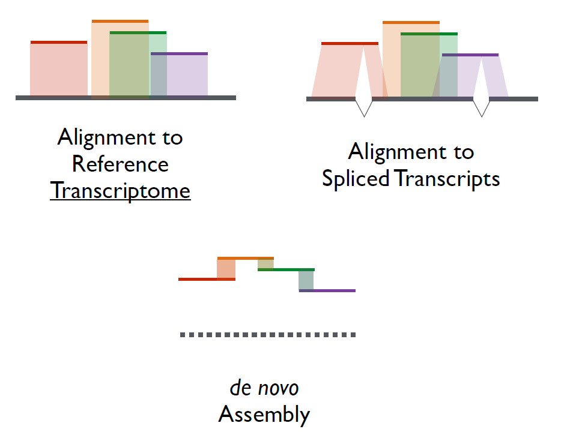
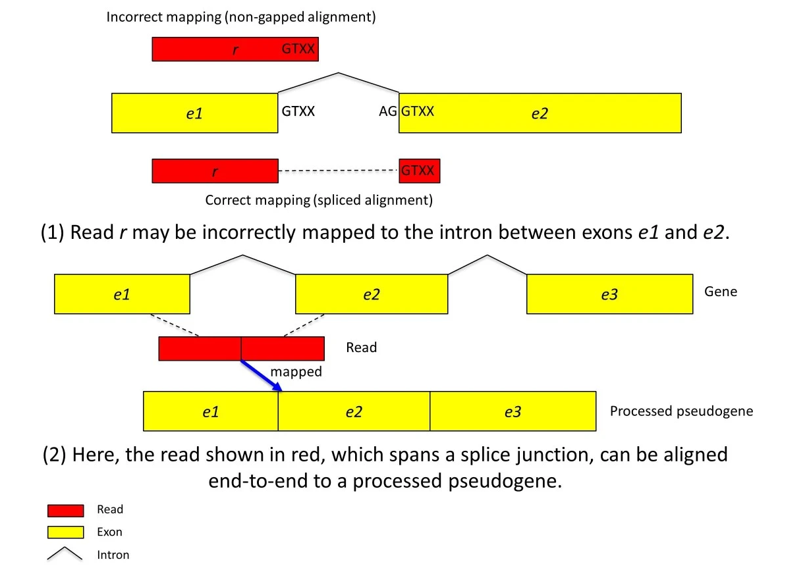

<h1 style="font-size: 40px; margin-bottom: 0px;">10.1 RNA-seq alignments</h1>

<h1>Overview</h1>

Last week, we went over the general RNA-seq pipeline and set up our first shell script to begin learning how we can take the steps we perform in Terminal and convert that into a more automated process. Like with ChIP-seq, we need to first align our data to a reference genome as a set up for further analysis. Today, we'll be reviewing and performing alignments for our truncated RNA-seq datasets that we generated last week. Everyone will be working with their own group's data for this, so we may all see slightly different outputs/results. As we continue with the RNA-seq module, see if you can identify ways to connect each of the lessons together into a single shell script for a more cohesive RNA-seq analysis pipeline.

Like last Friday, we'll start by setting up our script for today, and while it runs, we'll review the concepts behind RNA-seq alignment.

<strong>Learning objectives:</strong>

<ul> 
    <li>Learn how to run HISAT2 for aligning RNA-seq data</li>
    <li>Set up shell script for alignment</li>
    <li>Review splice-aware alignment</li>
    <li>Visualize RNA-seq alignments using IGV</li>
</ul>

<h1 style="font-size: 40px; margin-bottom: 0px;">HISAT2 alignment</h1>

<a href="https://daehwankimlab.github.io/hisat2/manual/" rel="noopener noreferrer" target="_blank"><u>Documentation for HISAT2 is here.</u></a>

Mapping reads is a common problem more generally referred to as text pattern mapping, where you search through text to find a certain sequence that you are trying to match (your query sequence). We saw how this worked using bowtie2 to align the ChIP-seq reads to the hg19 reference genome, and today, we'll use a different aligner (HISAT2) to align our RNA-seq datasets to the hg19 reference genome (<a href="#kim2019"><u>Kim et al 2019</u></a>). The key difference between ChIP-seq alignment and RNA-seq alignment is that when aligning reads from RNA-seq experiments, you need to account for the fact that your reads may span a splice junction, resulting in reads that have large gaps when aligned to a reference genome.

Before we dive into the details of RNA-seq alignments, let's set up a script in Terminal for us to run the alignment with our truncated dataset.

<h2>1. Set up <code>.sh</code> file</h2>

Like last week, let's set up a new shell script, but this week, let's name it <code>alignment-shell-script.sh</code>. We can begin the first line with the usual shebang.

<pre style="width: 450px; margin-top: 15px; margin-bottom: 15px; border: 1px solid; border-color: #AAAAAA; padding: 10px; border-radius: 4px; font-size: 12px; box-shadow: inset  0 0 5px 0 #CCCCCC;">#!/bin/bash</pre>

<h2>2. Set up any needed directories</h2>

To keep all the outputs more organized, we can set up any needed directories for our different outputs. Like with our ChIP-seq alignments, we'll have SAM files and BAM files, and we'll also have logs for our alignment statistics. So let's set up our script to create directories for each of these:

<pre style="width: 450px; margin-top: 15px; margin-bottom: 15px; border: 1px solid; border-color: #AAAAAA; padding: 10px; border-radius: 4px; font-size: 12px; box-shadow: inset  0 0 5px 0 #CCCCCC;">cd ~/MCB201B_F2024/Week_10
mkdir ./alignment-outputs
mkdir ./alignment-outputs/logs
mkdir ./alignment-outputs/sams
mkdir ./alignment-outputs/bams</pre>

<h2>3. Define PATH to HISAT2</h2>

Like with HOMER, we'll need to define the PATH to HISAT2, so that Terminal knows where to go to find HISAT2's files.

<pre style="width: 450px; margin-top: 15px; margin-bottom: 15px; border: 1px solid; border-color: #AAAAAA; padding: 10px; border-radius: 4px; font-size: 12px; box-shadow: inset  0 0 5px 0 #CCCCCC;">PATH=$PATH:/home/jovyan/shared/course/mcb201b-shared-readwrite/hisat2-2.2.1</pre>

The difference here is that I've set up HISAT2 within our shared directory, so that you can simply specify the PATH there in your shell script. Unlike HOMER, which requires write permission to its directory, HISAT2 does not.

For those of you who are doing the analysis on your own laptop, you can find information to get <a href="https://bioconda.github.io/recipes/hisat2/README.html" rel="noopener noreferrer" target="_blank"><u>hisat2 via conda here.</u></a> The path should automatically be set during installation.

<h2>4. Alignment using HISAT2</h2>

Now let's pause a bit to go over the code for alignments and for preparing our alignment outputs before we go back to editing our shell script.

Aligning using HISAT2 is similar to that of bowtie2 in that we need to provide the aligner with an index of the reference genome and the reads that we want it to align. In our case, we have the reference genome index files in our shared class folder <code>~/shared/course/mcb201b-shared-readwrite/rna-index</code>. HISAT2 has it's own way of indexing the genome in order to align reads, so we cannot use the same index files that we used for bowtie2's alignments.

Below is how you can set up HISAT2 to run for a <u>single replicate</u> and write a log containing the alignment statistics. We'll first dissect this line of code and then work together to figure out how we can incorporate this into our shell script.

<pre style="width: 500px; margin-top: 15px; margin-bottom: 15px; color: #000000; background-color: #EEEEEE; border: 1px solid; border-color: #AAAAAA; padding: 10px; border-radius: 15px; font-size: 12px;">hisat2 \
-x ~/shared/course/mcb201b-shared-readwrite/rna-index/hg19 \
-1 ~/MCB201B_F2024/Week_9/truncated_data/1M_g1_control_r1.fastq \
-2 ~/MCB201B_F2024/Week_9/truncated_data/1M_g1_control_r2.fastq \
--rna-strandness RF \
-S ~/MCB201B_F2024/Week_10/alignment-outputs/sams/1M_g1_control.sam \
--summary-file ~/MCB201B_F2024/Week_10/alignment-outputs/logs/1M_g1_control_alignment_log.txt \
--new-summary</pre>

Let's break down the code:

<code>hisat2</code>

This calls up the hisat2 program.

<code>-x ~/shared/course/mcb201b-shared-readwrite/rna-index/hg19</code>

This functions the same as in bowtie2. We indicate with the option <code>-x</code> the path to our reference genome index files along with the basename of those files. In this case, our index files are located in <code>~/shared/course/mcb201b-shared-readwrite/rna-index/</code>, and all the index files contain the same basename <code>hg19</code>.

<code>-1 ~/MCB201B_F2024/Week_9/truncated_data/1M_g1_control_r1.fastq</code>

This is one key difference between our RNA-seq alignment and ChIP-seq alignment. While the ChIP-seq data was from a single-end (SE) read, our RNA-seq data was obtained via paired-end (PE) sequencing, resulting in two sequence files associated with each replicate. With the <code>-1</code> option, we tell <code>hisat2</code> that we are providing the first mate file for our PE data.

If our data were unpaired, then we would like with bowtie2, use the <code>-U</code> option for unpaired or SE reads.

<code>-2 ~/MCB201B_F2024/Week_9/truncated_data/1M_g1_control_r1.fastq</code>

With the <code>-2</code> option, we provide hisat2 with the second mate file.

<code>--rna-strandness RF</code>

Recall that our RNA-seq library was generated with a specific strandedness with respect to the original mRNA fragment, so we will need to provide this information to the aligner using the <code>--rna-strandness</code> option along with the <code>RF</code> argument to indicate that our library is directional on the first strand.

<code>-S ~/MCB201B_F2024/Week_10/alignment-outputs/sams/1M_g1_control.sam</code>

Like with bowtie2, we can specify that we want a <code>.sam</code> output using the <code>-S</code> option followed by the file path and name of our SAM file that we want HISAT2 to create.

<code>--summary-file ~/MCB201B_F2024/Week_10/alignment-outputs/logs/1M_g1_control_alignment_log.txt</code>

The option <code>--summary-file</code> tells <code>hisat2</code> that we would like it to create a file containing alignment statistics, which we can then use to perform QC on our alignments. The argument after <code>--summary-file</code> is the file path and file name that we want the alignment statistics to be saved to.

<code>--new-summary</code>

This option alters the format of the summary file that is generated by the <code>--summary-file</code> so that we can analyze the alignment statistics together in aggregate using <code>multiqc</code> afterward.

<h2>5. Play with SAM files</h2>

<h3>5a. Pull out the first 100 rows of SAM file</h3>

We can have our shell script pull out the first 100 rows of our SAM output file for us to look at later using the usual <code>head</code> command with the <code>-n</code> option.

<pre style="width: 500px; margin-top: 15px; margin-bottom: 15px; color: #000000; background-color: #EEEEEE; border: 1px solid; border-color: #AAAAAA; padding: 10px; border-radius: 15px; font-size: 12px;">head -n 100
~/MCB201B_F2024/Week_10/alignment-outputs/sams/1M_g1_control.sam \
> ~/MCB201B_F2024/Week_10/alignment-outputs/logs/1M_g1_control_sam_trunc.txt</pre>

<h3>5b. Convert SAM to BAM</h3>

Like with our ChIP-seq data, we'll convert our SAM files to BAM files using the <code>samtools</code> command and <code>view</code> subcommand.

<pre style="width: 500px; margin-top: 15px; margin-bottom: 15px; color: #000000; background-color: #EEEEEE; border: 1px solid; border-color: #AAAAAA; padding: 10px; border-radius: 15px; font-size: 12px;">samtools view \
-b \
-o ~/MCB201B_F2024/Week_10/alignment-outputs/bams/1M_g1_control.bam \
~/MCB201B_F2024/Week_10/alignment-outputs/sams/1M_g1_control.sam</pre>

<h3>5c. Delete the SAM file</h3>

BAM files are simply just compressed SAM files, so we can go ahead and delete the SAM file now that we've compressed it into a BAM file. If we ever want to convert it back into a SAM file, we can simply make use of <code>samtools</code> without needing to re-run the aligner.

<pre style="width: 500px; margin-top: 15px; margin-bottom: 15px; color: #000000; background-color: #EEEEEE; border: 1px solid; border-color: #AAAAAA; padding: 10px; border-radius: 15px; font-size: 12px;">rm ~/MCB201B_F2024/Week_10/alignment-outputs/sams/1M_g1_control.sam</pre>

<h3>5d. Sort BAM file by position and index</h3>

Like with our ChIP-seq alignments, we'll need to sort our aligned reads by their chromosomal position and index the sorted BAM file. That way, we can load it into IGV to visualize the reads.

<pre style="width: 500px; margin-top: 15px; margin-bottom: 15px; color: #000000; background-color: #EEEEEE; border: 1px solid; border-color: #AAAAAA; padding: 10px; border-radius: 15px; font-size: 12px;">samtools sort \
-o ~/MCB201B_F2024/Week_10/alignment-outputs/bams/1M_g1_control_position.bam \
~/MCB201B_F2024/Week_10/alignment-outputs/bams/1M_g1_control.bam</pre>

<pre style="width: 500px; margin-top: 15px; margin-bottom: 15px; color: #000000; background-color: #EEEEEE; border: 1px solid; border-color: #AAAAAA; padding: 10px; border-radius: 15px; font-size: 12px;">samtools index \
~/MCB201B_F2024/Week_10/alignment-outputs/bams/1M_g1_control_position.bam</pre>

The resulting output files can then be downloaded an loaded into IGV to visualize our alignments and any splice junctions. We'll take a closer look later on after our shell script is complete.

<h3>5d. Sort BAM file by <u>name</u> for later counting</h3>

Tomorrow, we'll count how many reads map to each gene, and to prepare for that, we'll need another BAM file. Rather than sorting the aligned reads by position, we'll sort them by name so that each read of a read pair appear next to each together in the BAM file. This helps to keep the memory usage down when we do the counting.

We can re-run <code>samtools sort</code> and provide an additional option to indicate that we want to sort by name <code>-n</code>.

<pre style="width: 500px; margin-top: 15px; margin-bottom: 15px; color: #000000; background-color: #EEEEEE; border: 1px solid; border-color: #AAAAAA; padding: 10px; border-radius: 15px; font-size: 12px;">samtools sort \
-n \
-o ~/MCB201B_F2024/Week_10/alignment-outputs/bams/1M_g1_control_name.bam \
~/MCB201B_F2024/Week_10/alignment-outputs/bams/1M_g1_control.bam</pre>

<h2>6. Install <code>multiqc</code></h2>

<a href="https://github.com/MultiQC/MultiQC/tree/main" rel="noopener noreferrer" target="_blank"><u>Documentation for MultiQC is here.</u></a>

We can make use of MultiQC to pull together the alignment logs, so that we can take a look at our alignment information in an aggregate visualization (<a href="#ewels2016"><u>Ewels et al 2016</u></a>). While <code>multiqc</code> doesn't perform any of its own QC analyses, it can combine all the outputs from various QC modules (such as FastQC) and visualize them all together.

<pre style="width: 500px; margin-top: 15px; margin-bottom: 15px; color: #000000; background-color: #EEEEEE; border: 1px solid; border-color: #AAAAAA; padding: 10px; border-radius: 15px; font-size: 12px;">pip install multiqc</pre>

To run MultiQC, we can call up the <code>multiqc</code> command and supply it with the directory containing our logs.

<pre style="width: 500px; margin-top: 15px; margin-bottom: 15px; color: #000000; background-color: #EEEEEE; border: 1px solid; border-color: #AAAAAA; padding: 10px; border-radius: 15px; font-size: 12px;">multiqc \
~/MCB201B_F2024/Week_10/alignment-outputs/logs</pre>

<h2>7. Set up shell script with for loops where needed</h2>

Let's now dissect the inputs we use to run hisat2 and play with the alignment outputs for a single replicate, and now we will try to make it more generally applicable to either our control or tazko files.

<h2>8. Run the shell script</h2>

Run the shell script, and while it's running, we'll review RNA-seq alignments. Afterwards, we'll take a look at all the outputs that we generated.

<h1 style="font-size: 40px; margin-bottom: 0px; margin-top: 0px;">Review of RNA-seq alignment</h1>

<h4 style="text-align: center;"><strong>Fig 1</strong></h4>

RNA-seq read alignment strategies (Dr. Ingolia)

Recall from lecture that RNA-seq alignments have special considerations because of the processing of mRNA to remove introns and splice together exons. Three common methods for aligning reads are to align to a reference transcriptome, or reference genome, or to assemble transcripts de novo if a reference is unavailable (<strong>Fig 1</strong>).

<h4 style="text-align: center;"><strong>Fig 2</strong></h4>

Examples of incorrect read mapping (<a href="#kim2013"><u>Kim et al 2013</u></a>)

Alignment programs that are unable to account for large gaps in reads that span junctions may incorrectly map reads (<strong>Fig 2</strong>). They may either align the short read to only a single exon along with a penalty for the incorrectly matched basepairs, or they may incorrectly align the read to a pseudogene that doesn't contain an intervening intron, or they may remain unmapped. Splice aware aligners, such as HISAT2, can properly account for junctions, which you will be able to see when we load our alignments into IGV.

<h1 style="font-size: 40px; margin-bottom: 0px; margin-top: 0px;">Viewing alignment outputs</h1>

<h2>Viewing alignment statistics</h2>

Once your shell script has finished running, you should now have a number of output files to look through. We'll first take a look at the graph of aggregate alignment statistics generated by <code>multiqc</code>. This will give us an idea if there was an issue with how we set up the alignment or potentially an issue with our samples/replicates.

Generally, you'll want all your replicates to have similar alignment rates, and if there's a replicate that has drastically lower alignment rates, you may want to take a closer look to see if issues arose during the prep of that replicate.

<h2>Viewing SAM output</h2>

Let's take a look at the 100 rows that we pulled out of our SAM file. At first glance, it will look more or less the same as our SAM files from our ChIP-seq alignment. The notable differences will lie in the FLAG score and the CIGAR string (and the aligner-specific tags).

<h2>Viewing alignments in IGV</h2>

Go ahead and download the <code>*_position.bam</code> and <code>*_position.bam.bai</code> files and load them into IGV, so we can take a look at the alignments for our control and tazko samples.

<h3>Take a look at reads aligning to TAZ and YAP1</h3>

Let's take a look to see how the reads aligned for TAZ, given that we aimed to KO TAZ expression. <a href="https://www.ncbi.nlm.nih.gov/gene?Db=gene&Cmd=DetailsSearch&Term=25937" rel="noopener noreferrer" target="_blank"><u>TAZ (WWTR1) is located at 3q25.1.</u></a>

Let's also see how the reads look for YAP1, which we didn't KO. <a href="https://www.ncbi.nlm.nih.gov/gene?Db=gene&Cmd=DetailsSearch&Term=10413" rel="noopener noreferrer" target="_blank"><u>YAP1 is located at 11q22.1.</u></a>

<h3>Color by first-of-pair strand</h3>

We can also visualize the strandedness of our cDNA library in IGV as well. Right-click the read tracks and select "first-of-pair strand" under "Color alignments by". You should see the alignments colored either red or blue based on the direction of the cDNA library.

A cDNA library that is unstranded will have read alignments for a single gene with a mixed population when colored by direction, whereas a cDNA that is stranded will have read alignments that are all (or nearly all) the same color.

<h1 style="font-size: 40px; margin-bottom: 0px;">References</h1>

<a href="https://www.nature.com/articles/s41587-019-0201-4" rel="noopener noreferrer" target="_blank"><u>Kim et al 2019 Nat Biotech:</u></a> Graph-based genome alignment and genotyping with HISAT2 and HISAT-genotype

<a href="https://doi.org/10.1093/bioinformatics/btw354" rel="noopener noreferrer" target="_blank"><u>Ewels et al 2016 Bioinformatics:</u></a> MultiQC: summarize analysis results for multiple tools and samples in a single report

<a href="https://genomebiology.biomedcentral.com/articles/10.1186/gb-2013-14-4-r36" rel="noopener noreferrer" target="_blank"><u>Kim et al 2013 Genome Biol:</u></a> TopHat2: accurate alignment of transcriptomes in the presence of insertions, deletions and gene fusions
