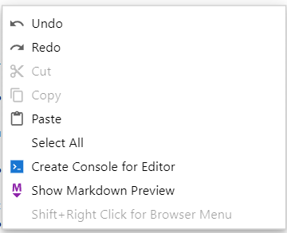
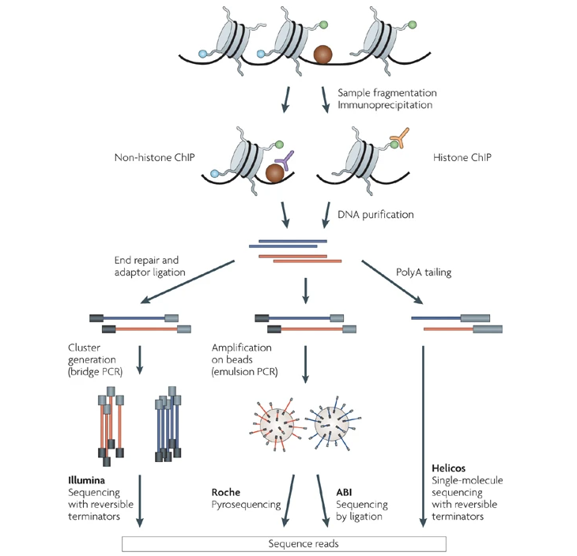
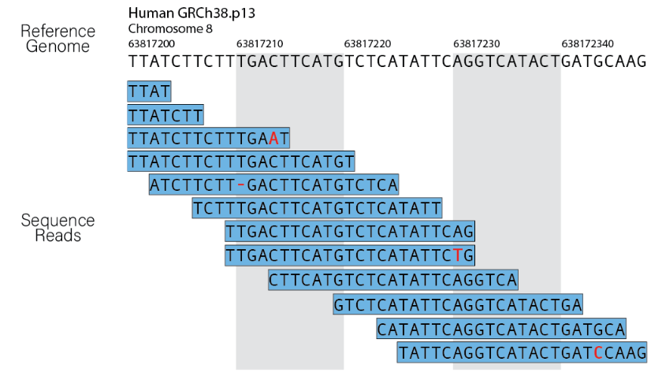
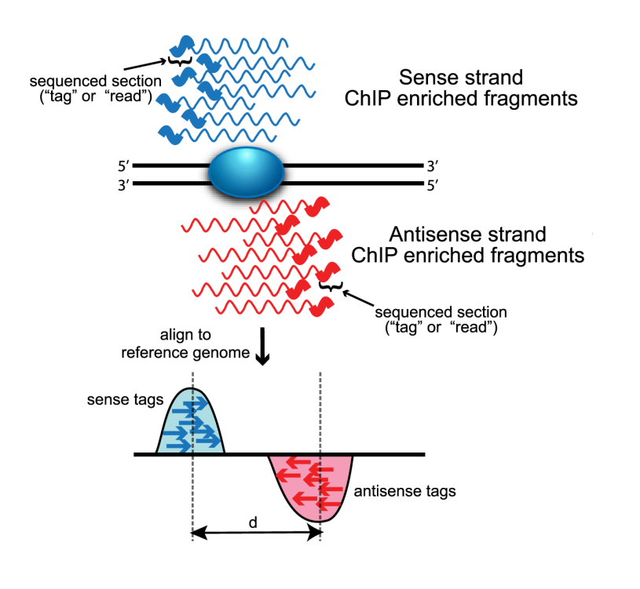
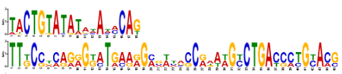
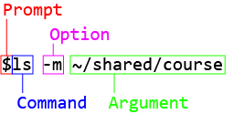

<h1 style="font-size: 40px; margin-bottom: 0px;">6.1 Intro to ChIP-seq pipeline</h1>

<hr style="margin-left: 0px; border: 0.25px solid; border-color: #000000; width: 100%;"></hr>

<h1>Viewing Markdown files</h1>

<p style="margin-top: 30px:">To view this Markdown file properly, right-click anywhere within this open document, and a menu should appear (<strong>Fig 1</strong>). One of the options will read <i>Show Markdown Preview</i>.</p>

<h4 style="text-align: center;"><strong>Fig 1</strong></h4>


<p style="margin-top: 30px;">The new window should open with the HTML and Markdown notations properly rendered.</p>

<h1>Overview</h1>

<p>We're now moving on to the ChIP-seq analysis module of our bioinformatics course. The goal of this module is to use big data analysis to identify the genes that may be regulated by TAZ by looking at the regions of DNA to which TAZ (and its associated TEAD DNA-binding protein) actually bind. In class, we'll practice using a truncated dataset to allow us to perform the analyses on a small subset of the larger dataset, and outside of class, you will perform the analysis but using the full datasets. If there's time in class, you can also start running the analyses on the complete dataset to save some time. The full dataset is rather large, so the analysis will take some time to run. You will want to keep this in mind, since your assignments will require you to turn in the results of your analysis.</p>
    
<p>To start, we'll go over the basic concepts that underlie ChIP-seq, and then we'll practice using command line to work with our sequencing files. We'll then take a look at the quality of our sequencing data.</p>

<p><strong>Learning objectives:</strong></p>
<ul>
    <li>Understand concepts behind ChIP-seq</li>
    <li>Understand command-line interface</li>
    <li>Learn to navigate files and directories in command line</li>
    <li>Learn to make sense of your environment</li>
    <li>Learn to perform QC on sequencing data</li>
    <li>Understand how to interpret QC results</li>
</ul>

<h1 style="font-size: 40px; margin-bottom: 0px;">ChIP-seq</h1>

<hr style="margin-left: 0px; border: 0.25px solid; border-color: #000000; width: 100%;"></hr>

<h2>Experimental design</h2>

<p>One of the main concepts that underlies ChIP-seq is a technique called chromatin immunoprecipitation (ChIP). Like with the more general technique of immunoprecipitation, ChIP takes advantage of the specificity of antibodies in order to select for specific proteins, namely proteins that interact with DNA either directly (such as histones) or indirectly through interactions with a DNA-binding protein (<a href="#park2009"><u>Park 2009</u></a>).</p>

<p>Prior to immunoprecipitation, samples are crosslinked with formaldehyde in order to stabilize molecular interactions, such as protein-protein or protein-DNA interactions (<strong>Fig 2</strong>). Then the DNA is fragmented via sonication, producing smaller fragments of DNA ranging from 200 to 600 base pairs, with any associated proteins still bound to it. DNA fragmentation is followed by immunoprecipitation using antibodies specific to the target protein or interest. As the target protein is pulled down, any bound DNA is pulled down along with it, allowing us to enrich for the regions in which the target protein is closely associated. To release the DNA from the protein, the crosslinking reaction is reversed, and the DNA can be purified. Afterwards, a sequencing library is prepared from the released DNA fragments, and next-generation sequencing (NGS) is carried out.</p>

<h4 style="text-align: center;"><strong>Fig 2</strong></h4>

<p style="text-align: center;">Image from: Park 2009 Nat Rev Genet</p>

<h2>ChIP-seq analysis pipeline overview</h2>

<p>Below is a brief overview of the main steps taken to analyze ChIP-seq data, and in later lectures, you'll learn about them in more detail.</p>

<h3>Raw sequence file</h3>

<p>As you'll recall from MCB201A, NGS allows for massively parallel sequencing of the DNA fragments in a library prep. The resulting sequence output contains all the sequence reads and the associated quality information for each base. The type of file it usually comes as is a compressed fastq (&ast;.fastq.gz) file. An (unmapped) <strong>.fastq</strong> file has a specific structure, where each sequencing read corresponds to 4 lines within the file, so a fastq file containing the sequence information for 10 reads will be 40 lines long.</p> 

<p>Each line for a sequence read contains a specific set of information:</p>

<table style="margin:auto;">
    <tr style="border: 1px solid; border-color: #000000;">
        <th>Line</th>
        <th>Details</th>
    </tr>
    <tr style="border: 1px solid; border-color: #000000;">
        <td>1</td>
        <td>A sequence identifier that contains information on the run</td>
    </tr>
    <tr style="border: 1px solid; border-color: #000000;">
        <td>2</td>
        <td>The sequence information</td>
    </tr>
    <tr style="border: 1px solid; border-color: #000000;">
        <td>3</td>
        <td>A separater line. Begins with <strong>&plus;</strong> and sometimes followed by the sequence identifier</td>
    </tr>
    <tr style="border: 1px solid; border-color: #000000;">
        <td>4</td>
        <td>Quality score information for each nucleotide encoded using ASCII to represent the numerical quality value</td>
    </tr>
</table>

<p style="margin-top: 30px;">How this looks like if you pull out the information for a single sequence read from a fastq file is something like:</p>

```
@LH00328:404:22GH3GLT4:8:1101:41814:1070 1:N:0:GTCAGTTG+CGATTGGA
TGGGGTGGTGGTGGTAATGAACATGATCTTCATGGTGAGAACAGGGGACAGTAAGATACAAACATTTTTTGGCATATGAAAATTTATTACTACAGTGTTTTCACCATTAATATTTATGATCTTGGTCTTTCCTTCTTGCCTTTGTATAGGG
+
IIIIIIIIIIIIIIIIIIIIIIIIIIIIIIIIIIIIIIIIIIIIIIIIIIIIIIIIIIIIIIIIIIIIIIIIIIIIIIIIIIIIIIIIIIIIIIIIIIIIIIIIIIIIIII9I9IIIIIIIIIIIIIIIIIIIIIIIIIIIIIIIIIIIII
```

<p>The quality score contained within the fourth line tells us the probability that the called base is incorrect. In other words, it tells us the likelihood that the sequence read is incorrect for that specific nucleotide. Using the example above, we can see that the first nucleotide <mark style="background-color: #EEEEEE;"><strong>T</strong></mark> has an associated quality score encoded as <mark style="background-color: #EEEEEE;"><strong>I</strong></mark>, which corresponds to a Phred-33 quality score of 40 (<a href="https://people.duke.edu/~ccc14/duke-hts-2018/bioinformatics/quality_scores.html#Phred-Quality-Scores" rel="noopener noreferrer" target="_blank"><u>What do quality scores mean?</u></a>). This tells us that the probability of the first base being incorrectly sequenced is 0.00008.</p>

<p>fastq files are often incredibly large, so they are often compressed into <strong>.fastq.gz</strong> file. Most programs that analyze sequencing data are able to handle both .fastq and .fastq.gz files, so you don't need to unzip the .fastq.gz file to use them for analysis.</p>

<h3>Quality assessment</h3>

<p>Prior to performing your analysis, you'll want to check the quality of your sequence reads in order to determine if there might be issues with your samples that you will want to keep in mind when performing your analyses. These issues could have arised from sample prep or the sequencing run itself, and they can point to biases or other confounding factors that can impact the interpretation of your sequencing data.</p>
    
<p>A common method to performing quality checks on raw sequence data is called <a href="https://www.bioinformatics.babraham.ac.uk/projects/fastqc/" rel="noopener noreferrer" target="_blank"><u><strong>FastQC</strong></u></a>, developed by Babraham Bioinformatics. FastQC takes in fastq (and the compressed form, fastq.gz) files and analyzes the raw sequence data with a series of modules that can highlight potential issues in a dataset. <a href="https://www.bioinformatics.babraham.ac.uk/projects/fastqc/Help/" rel="noopener noreferrer" target="_blank"><u>Information on the different modules and an explanation on how to interpret their results can be found in the FastQC documentation.</u></a></p>

<h3>Genome alignment</h3>

<p>To determine where our sequence reads came from, we need to align them to a reference genome (<strong>Fig 3</strong>), and the resulting alignments allow us to determine the distribution of sequence reads along the genome. In ChIP-seq, the resulting distribution of aligned sequences gives us an idea of the downstream transcriptional targets of a protein of interest. In our case, it will shed light on where TAZ (and TEAD) are binding and provide hints to what genes TAZ may be regulating, since we should be recovering a greater number of fragments corresponding to regions in the genome to which TAZ (and TEAD) are binding.</p>

<h4 style="text-align: center;"><strong>Fig 3</strong></h4>

<p style="text-align: center;">Image from: Harvard Chan Bioinformatics Core</p>

<h3>Peak calling</h3>

<p>Following genome alignment, regions of high alignment can be determined by peak calling (<strong>Fig 4</strong>). Tools such as MACS2 use the aligned reads to calculate the density of read counts throughout the genome in order to identify regions that have a large number of aligned reads. These peaks in read density tell us that the identified region is enriched within a dataset, suggesting a potential binding site for a protein of interest.</p>

<h4 style="text-align: center;"><strong>Fig 4</strong></h4>

<p style="text-align: center;">Image from: <a href="#wilbanksfacciotti2010"><u>Wilbanks and Facciotti 2010 PLoS ONE</u></a></p>

<h3>Motif discovery</h3>

<p>While peak calling can provide us with information on potential binding sites for a protein of interest, we can also perform further analyses to obtain information on specific binding motifs for a protein of interest. This process, called motif discovery, is used to identify similar patterns in peak sequences (<strong>Fig 5</strong>). These patterns can suggest that the enriched sequences are recognized by your protein of interest and can indicate a potential transcription factor binding motif.</p>

<h4 style="text-align: center;"><strong>Fig 5</strong></h4>

<p style="text-align: center;">Image from: <a href="https://meme-suite.org/meme/doc/examples/meme_example_output_files/meme.html"><u>MEME Suite</u></a></p>

<h1 style="font-size: 40px; margin-bottom: 0px;">Data files for this module</h1>

<hr style="margin-left: 0px; border: 0.25px solid; border-color: #000000; width: 100%;"></hr>

<p>Since we didn't perform ChIP-seq on our MDA-MB-231 cells, we'll be making use of a publicly available dataset from <a href="#zanconatoetal2015"><u>Zonconato et al 2015 Nat Cell Biol</u></a>, where they performed ChIP-seq analyses on MDA-MB-231 cells to identify how the YAP/TAZ transcriptional response is mediated.</p>

<p>The data files for ChIP-seq can be found in the <mark style="background-color: #EEEEEE;"><strong>shared</strong></mark> directory. This is a directory that is available to everyone, but cannot be modified. Inside the <mark style="background-color: #EEEEEE;"><strong>shared</strong></mark> directory, you'll find a number of subdirectories. The one we're specifically interested in is under <mark style="background-color: #EEEEEE;"><strong>course</strong></mark>. There, you'll find the <mark style="background-color: #EEEEEE;"><strong>mcb201b-shared-readwrite</strong></mark> subdirectory that will contain the files you will need for ChIP-seq (and later on for RNA-seq).</p>

<p>During class, we'll be doing a guided analysis using truncated sequence files that contain just 10 million reads (vs the almost 100 million reads of the full sequence file). These files have a prefix of <mark style="background-color: #EEEEEE;"><strong>10M_</strong></mark> to indicate that this is the truncated sequence file. You will take what you've learned in class to perform the analysis on the full dataset.</p>

<h1 style="font-size: 40px; margin-bottom: 0px;">Intro to command-line</h1>

<hr style="margin-left: 0px; border: 0.25px solid; border-color: #000000; width: 100%;"></hr>

<p>We'll be going over how to run commands in Terminal (a command-line interface or CLI) in Biology Hub. The initial steps of analyzing sequencing data requires you to use a CLI, so we'll first go over the basics of using command line to get you comfortable using Terminal.</p>

<h2>The command-line interface (CLI)</h2>

<p>Let's start up Terminal, and take a look at what we're presented with. If you want, you can split your JupyterLab view to see two (or more) open tabs at once. You can click and drag one of the tabs to the side or bottom of the workspace, and then the view should be split to show multiple tabs. That way, you can see this Markdown file while also working in Terminal.</p>

<p>With Terminal started up, you should see an empty prompt that only displays your username, the path to your current working directory, and all followed by a <mark style="background-color: #EEEEEE;"><code>&dollar;</code></mark>. The part of the line up to and including the <mark style="background-color: #EEEEEE;"><code>&dollar;</code></mark> is the prompt, and an empty prompt indicates to you that Terminal is waiting for an input.</p>

<p>An empty prompt will look something like the below:</p>

```
jovyan@jupyter-CalNetID:~$
```

<p>When you are following command-line examples, they often include the <mark style="background-color: #EEEEEE;"><code>&dollar;</code></mark>. You'll want to remember to only input the command that follows the prompt and do not include the <mark style="background-color: #EEEEEE;"><code>&dollar;</code></mark>.</p>

<p>For example:</p>

```
$ls
```

<p>or a full prompt followed by a command:</p>

```
jovyan@jupyter-CalNetID:~$ls
```

<p>You will want to type just the <mark style="background-color: #EEEEEE;"><code>ls</code></mark> and not <mark style="background-color: #EEEEEE;"><code>&dollar;ls</code></mark> when inputting the command into Terminal. To execute the command that you inputted, you can simply press <kbd>Enter</kbd>. If you have an empty prompt, the command line will start up a new empty prompt if you press <kbd>Enter</kbd>.</p>

<h4>Text cursor</h4>

<p>The prompt is followed by a blinking box, which is your text cursor, indicating where you are currently typing. You can move to a different spot in the line you are currently inputting by using the <kbd>&larr;</kbd> or <kbd>&rarr;</kbd> arrow keys. Note that text is added to the spot <strong><u>preceding</u></strong> your text cursor and not the spot that your text cursor is currently on. So if you have something like the below, where the highlighted letter indicates your text cursor's position:</p>

<code>
    jovyan@jupyter-CalNetID:~$some <mark style="background-color: #EEEEEE;"><u>c</u></mark>ommand line that you input
</code>

<p style="margin-top: 30px;">The new text that you add will be in front of the <code>c</code>.</p>

<code>
    jovyan@jupyter-CalNetID:~$some newtext<mark style="background-color: #EEEEEE;"><u>c</u></mark>ommand line that you input
</code>

<h2>Pull up a previous/subsequent line</h2>

<p>If you want to pull up a previously executed command, you can press the <kbd>&uarr;</kbd> arrow key to bring up a previous line, and you can use the <kbd>&darr;</kbd> arrow key to go to the subsequent line. This can come in handy if you want to either re-run a previously executed command or if you want to bring up a previous line and make modifications to it, so you don't have to retype everything.</p>

<h2>Terminate an actively running process</h2>

<p>If you are running something in Terminal and want to forcefully terminate the process, you can do so by pressing <kbd>Ctrl+C</kbd>, which will essentially abort the process that is actively running in Terminal.</p>

<h2>Suspend an actively running process</h2>

<p>If you want to pause a process without terminating it, you can instead press <kbd>Ctrl+Z</kbd>. This is different than forcefully terminating a program because it temporarily pauses the program without shutting it down.</p>

<p>You can restart the program in the foreground by inputting <code>fg</code> into the command line and pressing <kbd>Enter</kbd> to execute the command.</p>

```
$fg
```

<h2>Run a process in the background</h2>

<p>To run a process in the background, you can either end the command line with an <code>&amp;</code>, which will indicate that you want the process to run in the background when the command is executed. This is helpful for when you want to have the ability to use Terminal while some process runs in the background.</p>

<p>If you forget to input a <code>&amp;</code> at the end of the line, you can always press <kbd>Ctrl+Z</kbd>, which will pause the actively running process. Then if you input <code>bg</code> and execute the command, the paused process will resume running in the background.</p>

```
$bg
```


<h1 style="font-size: 40px; margin-bottom: 0px;">Command line syntax</h1>

<hr style="margin-left: 0px; border: 0.25px solid; border-color: #000000; width: 100%;"></hr>

<p>Like with all programming languages, there is a specific syntax that you will need to understand and follow in order for the CLI to execute your input correctly (<strong>Fig 6</strong>).</p>

<h4 style="text-align: center;"><strong>Fig 6</strong></h4>


<p style="margin-top: 30px;">In a loose way, the organization of command line syntax is similar to Python. The <strong>prompt</strong>, while not present in Python, indicates the start of a command line. The <strong>command</strong> is like a function in Python, where it executes some pre-defined set of operations. The <strong>option</strong> and the <strong>argument</strong> can both be thought of as parameters. Options alter how the command behaves, whilearguments tell the command what it should operate on. Options are preceded by either a <code>&dash;</code> or <code>&dash;&dash;</code>, which indicate a short form (abbreviated) or long form option, respectively. Most commands have options that can be written in a short form or an equivalent long form, and <a href="#finddoc"><u>you can find the different options for a command through its documentation.</u></a></p>

<h2>Spaces</h2>

<p>Spaces in command line have meaning and are used to separate the different parts of an input. If you refer back to <a href="#fig6"><strong>Fig 6</strong></a>, you can see that each part of your input is separated by spaces, so the command and individual options and arguments are all separated from each other with a space. That means you will want to be careful to not include spaces in your file names, otherwise it may appear as though you are providing additional argument or options. If your file name does have spaces, you can wrap it in double quotes <code>"file name"</code></p>

<h2>Line breaks</h2>

<p>If you have a long input, you can introduce line breaks to visually separate your input into separate lines by inputting a <code>\</code> and then pressing <kbd>Enter</kbd>. This will create a line break into your input, allowing you to continue to type in the next line without executing your code. Using the input from <a href="#fig6"><strong>Fig 6</strong></a> as an example:</p>

```
jovyan@jupyter-CalNetID:~$ls \
> -m \
> ~/shared/course
```

<p>You'll notice that there's a <mark style="background-color: #EEEEEE;"><code>&gt;</code></mark> at the beginning of each new line. This functions similarly to <mark style="background-color: #EEEEEE;"><code>&dollar;</code></mark>. In this case, it indicates an empty line that continues from the preceding one.</p>

<h2>Finding documentation</h2>

<p id="finddoc">You can output the documentation for different commands by inputting <code>--help</code> as an option following the command. For example:</p>

```
$ls --help
```

<p>This will output the documentation on the <code>ls</code> command, including possible options that you can input to modify how the command executes. You can see when you run the above command that the documentation provides information on how to use the command, what it does, as well as options and arguments that you can input.</p>

<h1 style="font-size: 40px; margin-bottom: 0px;">Working with directories and finding files</h1>

<hr style="margin-left: 0px; border: 0.25px solid; border-color: #000000; width: 100%;"></hr>

<p>Recall when we used operating system commands in Python, we were able to change our current working directory, navigate through different directories, and also list directories and files. Using command line, we can perform the same operations.</p>

<h2>Find your home directory</h2>

<p>By default, when you start up your Biology Hub server, you'll be in your home directory. So when you use the Launcher to open up Terminal, your current working directory will be your home directory. You should see something like:</p>

```
jovyan@jupyter-CalNetID:~$
```

<p>Note the little <code>&#126;</code> (tilde), which is an abbreviated way of indicating your home directory. You can see what the <code>&#126;</code> represents by inputting the following command to see the path of your home directory.</p>

```
$echo ~
```

<p>The <code>echo</code> command simply outputs your argument as text, so you should see some output text for the path <code>/home/jovyan</code>, which is what the <code>&#126;</code> represents. Another way to output your home directory path is:</p>

```
$echo $HOME
```

<p>You should see that both methods output the same result, so the <code>&#126;</code> is a way to shorthand your home directory path when you want to specify path names. There are occassional differences in how some processes handle <code>&#126;</code> and <code>$HOME</code>, so you'll want to keep that in mind.</p>

<h2>Listing files and folders</h2>

<p>To output the names of the files and folders in your current working directory, you can input:</p>

```
$ls
```

<p>This will output the list of files and folders that are present in your current working directory. This is similar to the Python function <mark style="background-color: #EEEEEE;"><strong>os.listdir()</strong></mark>.</p>

<p>If you provide a path name as an argument, then you can output the file and folder names for the directory that you specify without having to change to that directory:</p>

```
$ls ~/shared/course/mcb201b-shared-readwrite/chip
```

<p>The above command will output the names of the files housed in our class's <mark style="background-color: #EEEEEE;"><strong>chip</strong></mark> subdirectory.</p>

<h2>Change current working directory</h2>

<p>To change your current working directory, you can make use of <code>cd</code> followed by the path and/or directory name. If you do not specify a path, then Terminal will look for the folder name in your current working directory. However, if you provide it with a path, then it will change to the directory specified by the path that you give as an argument.</p>

<p>Change to your home directory:</p>

```
$cd ~
```

<p>This will change your current working directory to your home directory. If you then wanted to go into your server's copy of our class repository, then you can input:</p>

```
$cd MCB201B_F2024
```

<p>You will be taken into the <mark style="background-color: #EEEEEE;"><strong>MCB201B_F2024</strong></mark> directory. You can also see that the prompt preceding the <code>&dollar;</code> has been updated as well.</p>

```
jovyan@jupyter-CalNetID:~/MCB201B_F2024$
```

<p>This tells you that your current working directory is now your <mark style="background-color: #EEEEEE;"><strong>MCB201B_F2024</strong></mark> directory.</p>

<p>You can continue to enter subdirectories by providing their names as arguments to the <code>cd</code> command.</p>

```
$cd Week_1
```

<p>This will take you into your <mark style="background-color: #EEEEEE;"><strong>Week_1</strong></mark> directory. We can also specify this as a single argument to our <code>cd</code> command.</p>

```
$cd MCB201B_F2024/Week_1
```

<p>And this will take us into our <mark style="background-color: #EEEEEE;"><strong>Week_1</strong></mark> subdirectory.</p>

<p>If you wanted to change directly to a subdirectory located somewhere else, you can direct the command to start from your home directory before proceeding through the rest of the path name. For example, if you wanted to go directly to the <mark style="background-color: #EEEEEE;"><strong>images</strong></mark> subdirectory under <mark style="background-color: #EEEEEE;"><strong>Week_5</strong></mark>, then you can specify the <code>~</code> followed by the rest of the path name in your argument.</p>

```
$cd ~/MCB201B_F2024/Week_5/images
```

<h2>Root vs home vs current vs parent directory</h2>

<p>Something to keep in mind are the different levels of directories and how specific ones are referred to and ways to abbreviate their respective path name in command line.</p>

<ul>
    <li><strong>root</strong>: this is the highest level directory in your computer or server. It contains all the folders and files on your computer or server. It can be abbreviated as <code>&#47;</code>.</li>
    <li><strong>home</strong>: this is your user directory, and it is what you start up in by default. As mentioned previously, you can specify your home directory path via <code>~</code>.</li>
    <li><strong>current</strong>: this is the directory that you are currently working in. The file path can be specified via <code>&period;</code>.</li>
    <li><strong>parent</strong>: this is the directory immediately above your current working directory, and the parent directory is specified by <code>&period;&period;</code>.</li>
</ul>

<p>If you wanted to navigate to the folder above your current working directory, you can input:</p>

```
$cd ..
```

<p>This basically indicates that you want to change directories to the parent directory, which is the one above your current working directory. You can also then combine this with additional file paths either to go further up or to another directory located in the parent one.</p>

```
$cd ../..
```

<p>The above will go up two directories rather than just one.</p>

<p>Starting from the class <mark style="background-color: #EEEEEE;"><strong>Week_6</strong></mark> directory:</p>

```
$cd ../Week_5/images
```

<p>You will essentially go up to the parent directory, then find the <mark style="background-color: #EEEEEE;"><strong>Week_5</strong></mark> directory and then go to the <mark style="background-color: #EEEEEE;"><strong>images</strong></mark> directory within that.</p>

<h2>File Browser</h2>

<p>The convenient thing about the File Browser located on the left-hand side of your JupyterLab view is that you can navigate through your directories easily. Once you've entered some directory through the File Browser, and then open up Terminal, your current working directory will be whatever folder you're in. For example, if you first entered the <mark style="background-color: #EEEEEE;"><strong>Week_5</strong></mark> directory before launching Terminal, your Terminal will start up with <mark style="background-color: #EEEEEE;"><strong>Week_5</strong></mark> as the current directory.</p>

```
jovyan@jupyter-CalNetID:~/MCB201B_F2024/Week_5$
```

<p>But once you've started up Terminal, navigating through different folders in your File Browser will not change your current working directory in Terminal. You will need to use <code>cd</code> to then change your current working directory. So this is something you'll want to keep in mind.</p>

<h2>Making directories</h2>

<p>There are two ways for you to create new directories in your Biology Hub. The most intuitive way is to use the File Browser to quickly create a new directory in the one you're actively viewing in the File Browser. The way to do so in Terminal is to input the command <code>mkdir</code> followed by the name of the directory.</p>

```
$mkdir example_directory_name
```

<p>This command will create a directory named <mark style="background-color: #EEEEEE;"><strong>example_directory_name</strong></mark> within your current working directory.</p>

<p>If you need, you can also make use of the <code>-p</code> or <code>--parents</code> option to instruct the command to create the necessary parent directories if they don't exist.</p>

```
$mkdir -p grandparent/parent/kid
```

<p>This will instruct the system to create the <mark style="background-color: #EEEEEE;"><strong>kid</strong></mark> subdirectory within the <mark style="background-color: #EEEEEE;"><strong>parent</strong></mark> subdirectory, and that within the <mark style="background-color: #EEEEEE;"><strong>grandparent</strong></mark> directory. If the grandparent or parent directory does not exist, then the system will create those directories as needed in order to get to a final path name of <code>grandparent/parent/kid</code></p>

<h2>Move and copy directories or files</h2>

<p>Similar to making directories, there are two ways to move or copy items on your Biology Hub server. You can move and copy things through the File Browser, which is more intuitive. You can also make use of command line to perform these functions as well.</p>

<p>To move a file or directory in your current working directory to another location, you can make use of the <code>mv</code> command followed by the name of what you want to move and the path to the new destination.</p>

```
$mv folder_name ~/path/to/destination_folder
```

<p>To copy a file or folder, you can also make use of the File Browser, or you can use the <code>cp</code> command in Terminal. Similar to the <code>mv</code> command, the <code>cp</code> command will create a copy of your indicated file or folder at the specified destination folder. One thing you'll need to keep in mind is that if you want to copy a folder along with all its contents, you will need to provide the option <code>-r</code>.</p>

<p>For example, to copy a file in your current working directory:</p>

```
$cp file_to_copy ~/path/to/destination_folder
```

<p>But to copy a folder and its contents:</p>

```
$cp -r folder_to_copy ~/path/to/destination_folder
```

<p>Similar to the <code>mkdir</code> command, if you specify a path that does not exist, the <code>mv</code> and <code>cp</code> commands will create the missing directories to meet the path name you provided.</p>

<h2>Deleting files or directories</h2>

<p>If you want to delete something, the most intuitive way would be to use your File Browser. You can delete files by right-clicking and selecting <strong>Delete</strong>. If you want to use Terminal to delete files, you can use the <code>rm</code> command, with an added <code>-r</code> option to remove directories.</p>

<p>For example, to delete a file in your current working directory:</p>

```
$rm file_to_delete
```

<p>But if you wanted to delete a directory along with all its contents:</p>

```
$rm -r folder_to_delete
```

<h1 style="font-size: 40px; margin-bottom: 0px;">Terminal outputs</h1>

<hr style="margin-left: 0px; border: 0.25px solid; border-color: #000000; width: 100%;"></hr>

<p>For this section, let's create a directory named <mark style="background-color: #EEEEEE;"><strong>demo</strong></mark> in our <mark style="background-color: #EEEEEE;"><strong>Week_6 directory</strong></mark>.</p>

```
$mkdir ~/MCB201B_F2024/Week_6/demo
```

<p>Now let's navigate to our <mark style="background-color: #EEEEEE;"><strong>Week_6</strong></mark> directory</p>

```
$cd ~/MCB201B_F2024/Week_6
```

<p>As you have seen with a few of the commands that we've used, such as <code>ls</code> or <code>echo</code>, you get some output produced by Terminal that you can see within Terminal.</p>

<p>Let's take a look at the files and folders within our <mark style="background-color: #EEEEEE;"><strong>Week_6</strong></mark> directory by using the <code>ls</code> command.</p>

```
$ls
```

<p>This will output a list of items contained within your current directory, and if we wanted it to output an unsorted list, we can add the option <code>-f</code>.</p>

```
$ls -f
```

<h2>Redirecting an output</h2>

<p>To redirect an output to a file, you can make use of the redirect symbol <code>&gt;</code> followed by the specific file you want to create to store the output.</p>

<p>For example, if we wanted to create a plain text file from our list of file names, we can redirect the output to a .txt file in our newly created <mark style="background-color: #EEEEEE;"><strong>demo</strong></mark> directory.</p>

```
$ls -f > ./demo/files_list.txt
```

<p>If we simply wrote <code>ls -f &gt; files_list.txt</code>, then the .txt file will be created within our current working directory, but since we specified a file path, it will be created in the specified location.</p>

<p>We can also do the same with other commands. For example, if we wanted to redirect the text output that results from the <code>echo</code> command:</p>

```
$echo "My cat likes chin scratches." > ./demo/cat.txt
```

<p>You can if you want, also use this to save documentation for a command.</p>

```
$fastqc --help > fastqcmanual.txt
```

<h2>Piping</h2>

<p>A useful symbol in command line is the <code>&vert;</code>, also known as a pipe symbol. Pipes are useful to pass (or "pipe") the output of one command as an input for the next command. In other words, the output from the command to the left of the pipe is used as the input for the command to the right of the pipe.</p>

<p>For example, if we use an unsorted list of files and folders from the <code>ls -f</code> command, we can pass that output to the sort command to have a sorted output.</p>

```
$ls -f | sort
```

<p>We can combine this with the redirect symbol <code>&gt;</code> to then redirect the resulting sorted list to a .txt file:</p>

```
$ls -f | sort > ./demo/sorted_file_list.txt
```

<p>Open files in command line</p>

<p>You can open up plain text files in Terminal by using the <code>cat</code> command. This command concatenates your file to the standard output, so it becomes a readable output in your CLI window.</p>

```
$cat fastqcmanual.txt
```

<p>This command can also be used to concatenate files together into new files when the output is redirected using <code>&gt;</code></p>

<p>Similar to Python, you can make use of the head and tail of a file to pull up the beginning or end section of your text file. The <code>head</code> command will pull up the first 10 lines by default, but you can input the option <code>-n</code> followed by an integer to instruct the <code>head</code> command to provide a certain number of lines. The same can be done for the <code>tail</code> command, but it will provide the last lines of your file.</p>

```
$head -n 5 fastqcmanual.txt
```

<p>To view the end section of a file:</p>

```
$tail -n 5 fastqcmanual.txt
```

<p>The previous commands opened your file into the standard Terminal output, but you can also open up a file to view temporarily by using the <code>less</code> command. This command will pull up the contents of the indicated file, but it will not be part of the standard output. You'll be able to exit from viewing the file by pressing <kbd>Q</kbd>, and you'll return to an empty prompt.</p>

```
$less fastqcmanual.txt
```

<p>You can make use of pipes to also view just a portion of your file outside of the standard output:</p>

```
$head -n 15 fastqcmanual.txt | less
```

<h1 style="font-size: 40px; margin-bottom: 0px;">Exercises: CLI practice</h1>

<hr style="margin-left: 0px; border: 0.25px solid; border-color: #000000; width: 100%;"></hr>

<p>For this first set of exercises, you'll practice using Terminal to work with directories and to view files.</p>

<p style="border-top: 1px solid; border-color: #EEEEEE; margin-top: 40px; margin-bottom: 10px;">1. Return to your home directory</p>

<div style="width: 90%; background-color: #EEEEEE; border: 1px solid; border-color: #777777; border-radius: 15px; padding-left: 20px; padding-bottom: 20px; position: relative;">
<code>
$cd ~
</code>
</div>

<p style="border-top: 1px solid; border-color: #EEEEEE; margin-top: 40px; margin-bottom: 10px;">2. Navigate to the <code>Week_6</code> directory in your server's copy of the class repo</p>

<div style="width: 90%; background-color: #EEEEEE; border: 1px solid; border-color: #777777; border-radius: 15px; padding-left: 20px; padding-bottom: 20px; position: relative;">
<code>
$cd ~/MCB201B_F2024/Week_6
</code>
</div>

<p style="border-top: 1px solid; border-color: #EEEEEE; margin-top: 40px; margin-bottom: 10px;">3. Create a folder named <code>fastqc_results</code></p>

<div style="width: 90%; background-color: #EEEEEE; border: 1px solid; border-color: #777777; border-radius: 15px; padding-left: 20px; padding-bottom: 20px; position: relative;">
<code style="margin-top: 0px; top: 50%">
$mkdir fastqc_results
</code>
</div>

<p style="border-top: 1px solid; border-color: #EEEEEE; margin-top: 40px; margin-bottom: 10px;">4. Navigate to <code>fastqc_results</code> and create a folder named <code>seq_view</code></p>

<div style="width: 90%; background-color: #EEEEEE; border: 1px solid; border-color: #777777; border-radius: 15px; padding-left: 20px; padding-bottom: 20px; position: relative;">
<code style="margin-top: 0px; margin-bottom: 0px; top:80%">
$cd fastqc_results
$mkdir seq_view
</code>
</div>

<p style="border-top: 1px solid; border-color: #EEEEEE; margin-top: 40px; margin-bottom: 10px;">5. Change your current working directory to <code>seq_view</code></p>

<div style="width: 90%; background-color: #EEEEEE; border: 1px solid; border-color: #777777; border-radius: 15px; padding-left: 20px; padding-bottom: 20px; position: relative;">
<code style="margin-top: 0px; margin-bottom: 0px; top:80%">
$cd seq_view
</code>
</div>

<p style="border-top: 1px solid; border-color: #EEEEEE; margin-top: 40px; margin-bottom: 10px;">6. Output the first 10 reads of <code>10M_ctrl_1.fastq</code>. Remember that a fastq file has 4 lines for each read.</p>

<div style="width: 90%; background-color: #EEEEEE; border: 1px solid; border-color: #777777; border-radius: 15px; padding-left: 20px; padding-bottom: 20px; position: relative;">
<code style="margin-top: 0px; margin-bottom: 0px; top:80%">
$head -n 40 ~/shared/course/mcb201b-shared-readwrite/chip/10M_ctrl_1.fastq
</code>
</div>

<p style="border-top: 1px solid; border-color: #EEEEEE; margin-top: 40px; margin-bottom: 10px;">7. Take a look at the raw sequence data for these reads.</p>

<p>&#128065;&#128068;&#128065;</p>

<p style="border-top: 1px solid; border-color: #EEEEEE; margin-top: 40px; margin-bottom: 10px;">8. Direct your output from 6 to a new .fastq file in your <code>seq_view</code> directory.</p>

<div style="width: 90%; background-color: #EEEEEE; border: 1px solid; border-color: #777777; border-radius: 15px; padding-left: 20px; padding-bottom: 20px; position: relative;">
<code style="margin-top: 0px; margin-bottom: 0px; top:80%">
$head -n 40 ~/shared/course/mcb201b-shared-readwrite/chip/10M_ctrl_1.fastq > ctrl_1_demo.fastq
</code>
</div>

<p style="border-top: 1px solid; border-color: #EEEEEE; margin-top: 40px; margin-bottom: 10px;">9. Repeat 6-8 for <code>10M_taz_1.fastq</code>.</p>

<div style="width: 90%; background-color: #EEEEEE; border: 1px solid; border-color: #777777; border-radius: 15px; padding-left: 20px; padding-bottom: 20px; position: relative;">
<code style="margin-top: 0px; margin-bottom: 0px; top:80%">
$head -n 40 ~/shared/course/mcb201b-shared-readwrite/chip/10M_taz_1.fastq > taz_1_demo.fastq
</code>
</div>

<p style="border-top: 1px solid; border-color: #EEEEEE; margin-top: 40px; margin-bottom: 10px;">10. Open up one of your truncated datasets (either from 8 or 9) outside of the standard output (using the <code>less</code> command).</p>

<div style="width: 90%; background-color: #EEEEEE; border: 1px solid; border-color: #777777; border-radius: 15px; padding-left: 20px; padding-bottom: 20px; position: relative;">
<code style="margin-top: 0px; margin-bottom: 0px; top:80%">
$less ctrl_1_demo.fastq
</code>
</div>

<p style="margin-top:10px; margin-bottom: 10px;">Press <kbd>Q</kbd> to exit viewing the file.</p>

<div style="width: 90%; background-color: #EEEEEE; border: 1px solid; border-color: #777777; border-radius: 15px; padding-left: 20px; padding-bottom: 20px; position: relative;">
<code style="margin-top: 0px; margin-bottom: 0px; top:80%">
$less taz_1_demo.fastq
</code>
</div>

<p style="margin-top:10px; margin-bottom: 10px;">Press <kbd>Q</kbd> to exit viewing the file.</p>

<h1 style="font-size: 40px; margin-bottom: 0px;">FastQC</h1>

<hr style="margin-left: 0px; border: 0.25px solid; border-color: #000000; width: 100%;"></hr>

<p><a href="https://www.bioinformatics.babraham.ac.uk/projects/fastqc/" rel="noopener noreferrer" target="_blank"><u>FastQC</u></a> is developed by Simon Andrews at the Babraham Institute in the UK. FastQC is a quick way to take a look at the quality of your raw sequence reads in order to get a general idea of how it looks and if there may be a bias in your data that could affect your analysis and/or interpretation of your data. There is a range of analyses that FastQC performs to assess the quality of your raw sequence reads, and they help you to get an idea of whether an issue may have occurred during sample prep, library prep, or sequencing.</p>

<p>There are a number of analysis modules with more detailed information and examples that can be found on <a href="https://www.bioinformatics.babraham.ac.uk/projects/fastqc/Help/3%20Analysis%20Modules/" rel="noopener noreferrer" target="_blank"><u>the FastQC documentation pages.</u></a></p>

<p>While it is helpful to run FastQC to get an idea of the quality of your sequence data, you should also be aware that each library prep will be different and just because it shows up as a <strong>Fail</strong> in FastQC, it may be fine in the context of what you're studying. The results of the FastQC file may point you to where you may want to look if it the outcome is not what you expect.</p>

<h2>Running FastQC in Terminal</h2>

<p>We'll do a guided practice to perform a FastQC analysis on truncated sequence files:</p>

<ul>
    <li><code>10M_ctrl_1.fastq</code></li>
    <li><code>10M_taz_1.fastq</code></li>
</ul>


<p>Let's first navigate to the shared directory containing our sequence files.</p>

```
$cd ~/shared/course/mcb201b-shared-readwrite/chip
```

<p>You should then see your empty prompt indicating the updated current working directory:</p>

```
jovyan@jupyter-CalNetID:~/shared/course/mcb201b-shared-readwrite/chip$
```

<p>Now, let's run FastQC with the first truncated sequence file <code>10M_ctrl_1.fastq</code></p>

```
fastqc -o ~/MCB201B_F2024/Week_6/fastqc_results 10M_ctrl_1.fastq
```

<p><strong><u>Let's break down the code:</u></strong></p>

<p><code>fastqc</code>: This is our command. We are instructing Terminal to run the fastqc program.</p>

<p><code>-o</code>: This is an option that we input to modify how the command behaves. In this case, we are instructing it to output the resulting files to a specific path that we provide after this option.</p>

<p><code>~/MCB201B_F2024/Week_6/fastqc_results</code>: This is the path to the directory that we want the fastqc results to be saved.</p>

<p><code>10M_ctrl_1.fastq</code>: This is the fastq file that we want the fastqc program to analyze. If our current working directory did not have this file name, then we would have had to also include the path to the fastq file.</p>

<p>It's kind of in a way like calling up a function in Python and providing it with specific arguments:</p>

```
fastqc(o="~/MCB201B_F2024/Week_6/fastqc_results", "10M_ctrl_1.fastq")
```

<h1 style="font-size: 40px; margin-bottom: 0px;">Exercises: FastQC analysis</h1>

<hr style="margin-left: 0px; border: 0.25px solid; border-color: #000000; width: 100%;"></hr>

<p>Now give it a try for the other file <code>10M_ctrl_1.fastq</code>.</p>

<p style="border-top: 1px solid; border-color: #EEEEEE; margin-top: 40px; margin-bottom: 10px;">1. Run <code>fastqc</code> for the truncated TAZ ChIP-seq dataset</p>

<div style="width: 90%; background-color: #EEEEEE; border: 1px solid; border-color: #777777; border-radius: 15px; padding-left: 20px; padding-bottom: 20px; position: relative;">
<code style="margin-top: 0px; margin-bottom: 0px; top:80%">
$fastqc -o ~/MCB201B_F2024/Week_6/fastqc_results 10M_taz_1.fastq
</code>
</div>

<p style="border-top: 1px solid; border-color: #EEEEEE; margin-top: 40px; margin-bottom: 10px;">2. In the File Browser, navigate to the <code>fastqc_results</code> directory</p>

<p style="border-top: 1px solid; border-color: #EEEEEE; margin-top: 40px; margin-bottom: 10px;">3. Download the HTML files for both the control and TAZ datasets</p>

<p style="border-top: 1px solid; border-color: #EEEEEE; margin-top: 40px; margin-bottom: 10px;">4. Take a look at the analysis results for both the control and TAZ samples</p>

<p style="border-top: 1px solid; border-color: #EEEEEE; margin-top: 40px; margin-bottom: 10px;">5. How does the quality look like for these two samples?</p>

<p style="border-top: 1px solid; border-color: #EEEEEE; margin-top: 40px; margin-bottom: 10px;">6. If you have extra time in class, you can feel free to get started on running the fastqc analysis on the complete datasets:</p><ul>
    <li><code>ctrl_1.fastq.gz</code></li>
    <li><code>ctrl_2.fastq.gz</code></li>
    <li><code>taz_1.fastq.gz</code></li>
    <li><code>taz_2.fastq.gz</code></li>
</ul>

<h1 style="font-size: 40px; margin-bottom: 0px;">References</h1>

<hr style="margin-left: 0px; border: 0.25px solid; border-color: #000000; width: 100%;"></hr>

<p id="park2009" style="padding-left: 20px;"><a href="https://www.nature.com/articles/nrg2641" rel="noopener noreferrer" target="_blank"><u>Park 2009 Nat Rev Genet:</u></a> ChIP–seq: advantages and challenges of a maturing technology</p>

<p id="zanconatoetal2015" style="padding-left: 20px;"><a href="https://www.nature.com/articles/ncb3216" rel="noopener noreferrer" target="_blank"><u>Zanconato et al 2015 Nat Cell Biol:</u></a> ChIP–seq: advantages and challenges of a maturing technology</p>

<p id="wilbanksfacciotti2010" style="padding-left: 20px;"><a href="https://www.nature.com/articles/ncb3216" rel="noopener noreferrer" target="_blank"><u>Wilbanks and Facciotti 2010 PLoS ONE:</u></a> Evaluation of Algorithm Performance in ChIP-Seq Peak Detection</p>


