<h1 style="font-size: 40px; margin-bottom: 0px;">7.1 ChIP-seq alignment</h1>

Today, we'll review the results of the FastQC analysis with our truncated dataset, and then we will align our datasets to the genome. After we perform our alignments, we'll take a look at the resulting files generated by bowtie2, and then we'll load the files into the Integrative Genome Viewer (IGV) to take a look at where reads have aligned to the genome.

<strong>Learning objectives:</strong>

<ul>
    <li>Review how to interpret the results of FastQC</li>
    <li>Learn to use bowtie2 to perform alignments</li>
    <li>Understand bowtie2 outputs</li>
    <li>Learn to use samtools to work with alignment output</li>
    <li>Learn to use IGV to visualize aligned reads</li>
</ul>

<h1 style="font-size: 40px; margin-bottom: 0px;">FastQC review</h1>

Last week, we performed a FastQC analysis of our truncated datasets, and today, we'll be taking a short dive into the results of the analyses to better understand the different analysis modules.

After running <code>fastqc</code>, you'll have two output files, one of which is an HTML file and the other which is a .zip file containing the individual graphs as separate files, as well as the data for each of those graphs.

<a href="https://www.bioinformatics.babraham.ac.uk/projects/fastqc/" rel="noopener noreferrer" target="_blank"><u>Documentation for FastQC is here.</u></a>

<h2>Basic statistics</h2>

The first thing you'll see is the summary statistics and general file information for your sequence file (<strong>Fig 1</strong>).

<h4 style="text-align: center;"><strong>Fig 1</strong></h4>
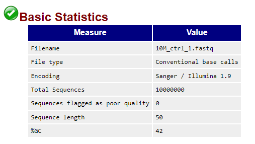

Summary statistics for <code>10M_ctrl_1.fastq</code>

This provides you general information about your sequence file.

<h2>Per base sequence quality</h2>

<h4 style="text-align: center;"><strong>Fig 2</strong></h4>
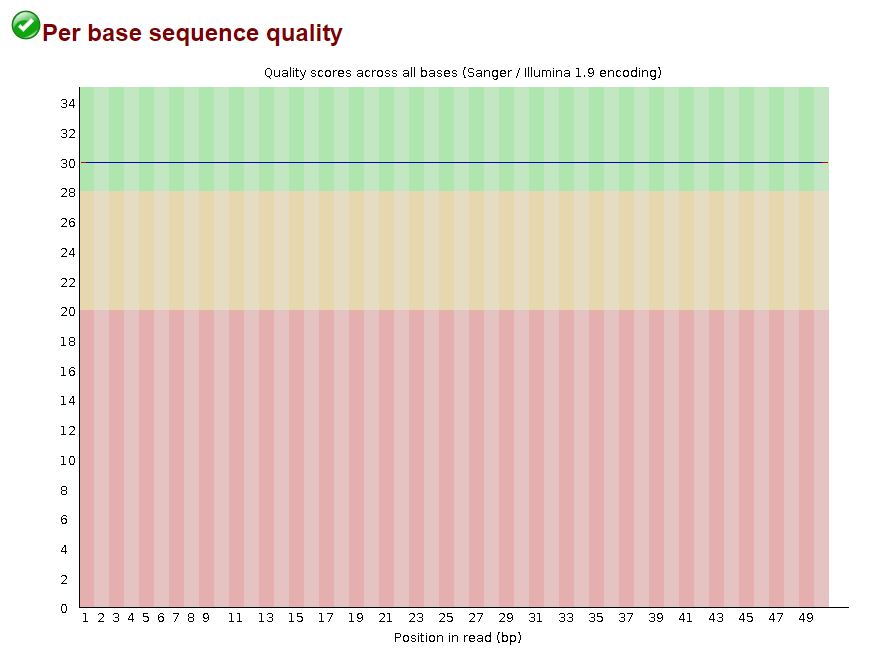

Per base sequence quality for <code>10M_ctrl_1.fastq</code>

Next, you'll see the per base sequence quality, which displays the stastitical information on your sequence read quality (<strong>Fig 2</strong>). The X-axis is the position along the read, while the Y-axis is the average quality score at that specific position for all reads. Recall from lecture and lesson 6.1 that .fastq files also contain the read quality information for each base of a sequence read, and the information is usually conveyed through a Phred score:

<pre>
@SRR1810912.1 HWI-ST1210:136:C1RBDACXX:5:1101:1472:2121 length=50
CACTGTAATTTCCCTAAAACAGGAGGTCACGGTAAGTCCTATGGATAGAT
+SRR1810912.1 HWI-ST1210:136:C1RBDACXX:5:1101:1472:2121 length=50
??????????????????????????????????????????????????
</pre>

This module takes the average score at each position for all sequences and visualizes the data in the form of a box-and-whisker plot, with the inner quartile range covered by the yellow box and the whiskers depicting the lower and upper 10th percentiles. The blue line represents the calculated average Phred score at that postion, and in the case of the ChIP-seq data we're using, all the bases appear to have a Phred-33 score of 30, represented by the ASCII <code>&quest;</code>.

The results of this analysis module can be quite important in that it lets you know if there may have been something that went wrong during sequencing, especially if most of the bases are of poor or highly variable quality. Usually, towards the end of a sequence read, the quality should dip a bit because of the nature of sequencing. Somtimes the elongation fails to continue in a greater and greater proportion of the strands or the clonal strands desync, so then the base can't be accurately called from the mixed fluorescent signal.

<h2>Per tile sequence quality</h2>

<h4 style="text-align: center;"><strong>Fig 3</strong></h4>
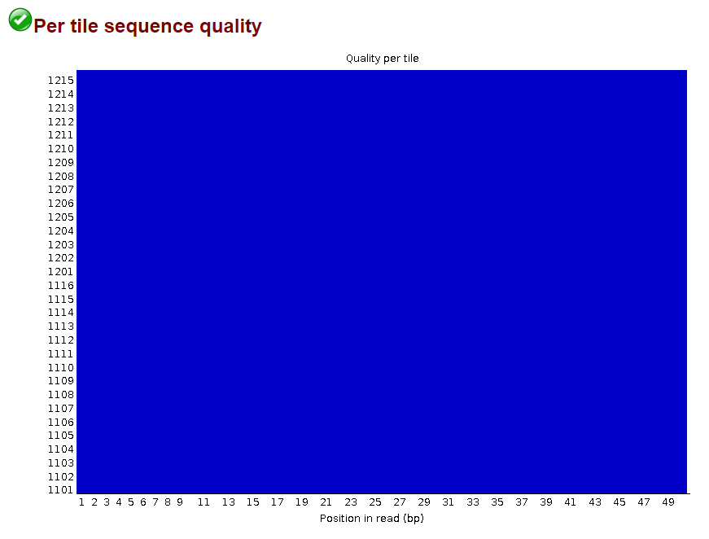

Per tile sequence quality for <code>10M_ctrl_1.fastq</code>

For Illumina sequencing platforms, each sequence read retains its original sequence identifier, so the read can be traced back to its specific flow cell tile (<strong>Fig 4</strong>).
 

<h4 style="text-align: center;"><strong>Fig 4</strong></h4>
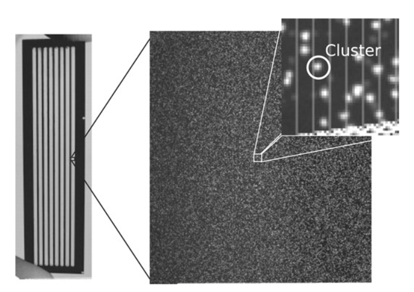

Image from <a href="#whiteford2009">Whiteford et al 2009</a>

The Illumina sequencing platform makes use of flow cells, which contain nanoscale wells that allow for clonal library amplification and subsequent sequencing by synthesis. If you recall from MCB201A and Dr. Ingolia's lectures, Illumina sequencing by synthesis technology uses fluorescently labeled nucleotides whose signal can be captured via imaging. Repeated images of the same section (a tile) of a flowcell allow for the sequence of the clonally amplified fragments to be read out as the progression of fluorescence signals when the clonal population of DNA fragments is extended. A tile is then considered a defined section of the flow cell that is repeatedly imaged, and a single tile can capture the sequences of a large number of clonal fragments (or clusters). Within a single flow cell, there are many, many tiles.

So the information presented by this module can be thought of as a 3D matrix, where the 1st axis (or X-axis) contains the position of that base within the sequence reads, the 2nd axis (or Y-axis) contains essentially the tile ID, and the 3rd axis (the heatmap color) is the average read quality at that position (Phred score) for that tile.

Issues that are identified through this analysis module generally point to some issue with the sequencing run, such as an issue calling bases or something obscuring the view of the imager, which would lead to an inability to call the base with high confidence. Since the data we use for ChIP-seq has a Phred-33 score of <code>&quest;</code> for all bases, we see a homogeneous graph for the per tile sequence quality.

If we take a quick look at one fastq file from our later RNA-seq data in <strong>Fig 5</strong>:

<h4 style="text-align: center;"><strong>Fig 5</strong></h4>
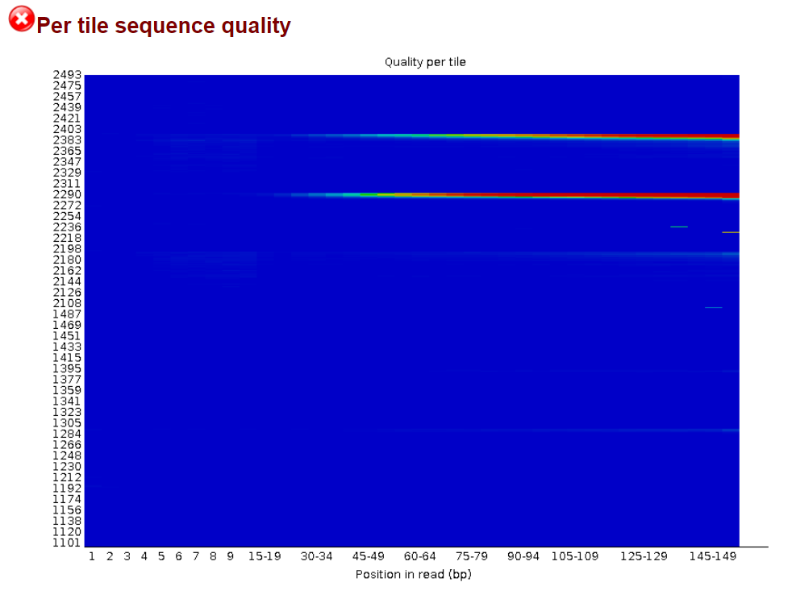

Per tile sequence quality for <code>G1 RNA-seq data</code>

We can see that most of the tiles look good, but for two of the tiles, there is an issue with the read quality in the later positions of the sequence reads. This type of issue generally points to a potential obstruction of the flow cell that occurred during imaging, which occurred partway through sequencing, so the later sequence read quality is impacted. This could be due to something like dust or some other particulate falling onto the flow cell or potentially something getting stuck in the flow cell, both of which can obscure those tiles and their fluorescence signals.

<h2>Per sequence quality score</h2>

<h4 style="text-align: center;"><strong>Fig 6</strong></h4>
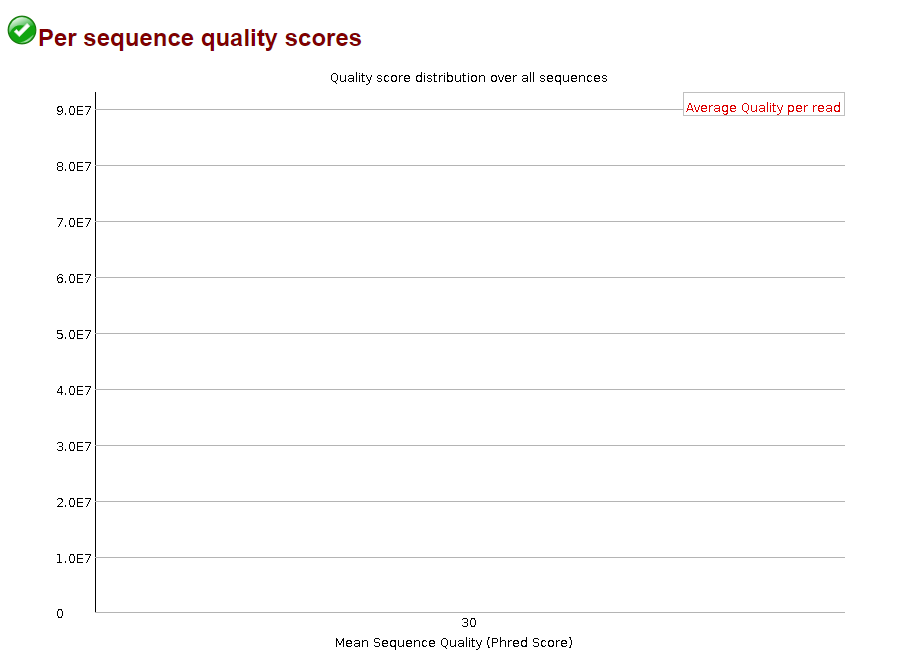

Per sequence quality score for <code>10M_ctrl_1.fastq</code>

The next analysis module is the per sequence quality score (<strong>Fig 6</strong>), which plots the distribution of the different Phred scores among all your sequence reads. So it's essentially like a histogram, where the X-axis is the average Phred score for a sequence read (not position), and the Y-axis is the number of reads that have that mean Phred score. A good sequencing run will have the peak of your distribution towards the higher end of the mean Phred score, indicating that your reads are mostly all good quality.

Again, since the reads for the ChIP-seq dataset is all <code>&quest;</code>, we can get a better feel for this analysis module by looking at our RNA-seq dataset in <strong>Fig 7</strong>:

<h4 style="text-align: center;"><strong>Fig 7</strong></h4>
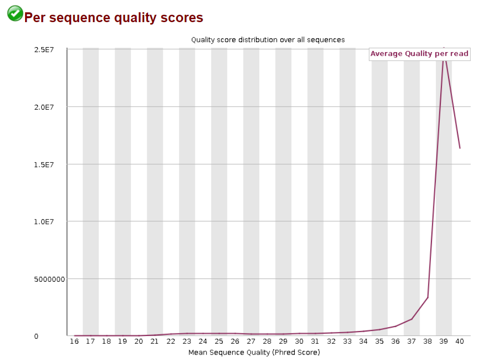

Per sequence quality score for <code>G1 RNA-seq data</code>

We can see that there is a nice peak towards the higher Phred scores, indicating that the vast majority of our reads are of good quality.

<h2>Per base sequence content</h2>

<h4 style="text-align: center;"><strong>Fig 8</strong></h4>
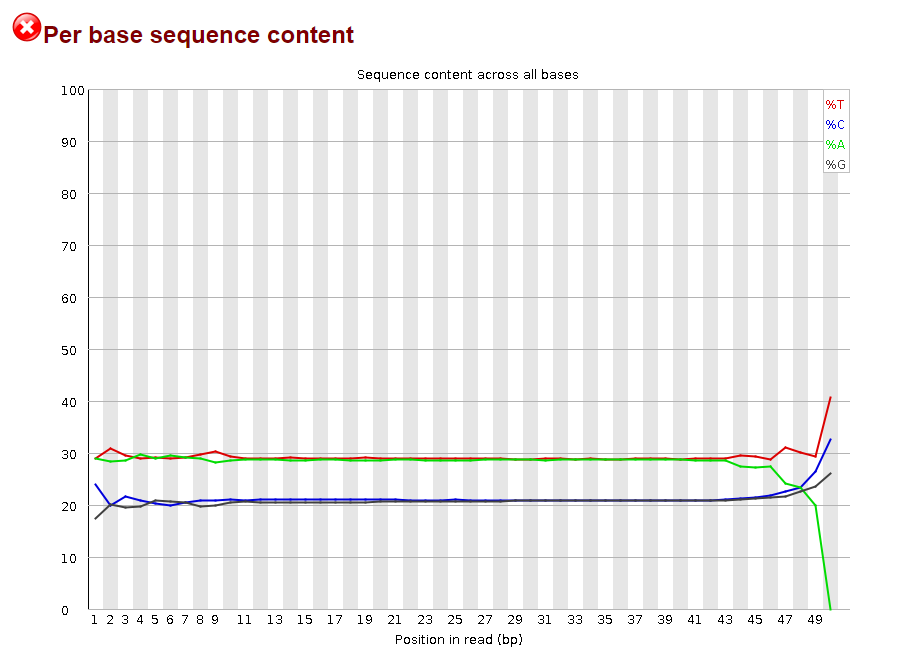

Per base sequence content for <code>10M_ctrl_1.fastq</code>

This analysis module takes a look at the proportions of each nucleotide for your sequence reads (<strong>Fig 8</strong>). Since our data comes from amplified fragments of the human genome, we would expect that the proportions of nucleotides should be close to the human genome. Since the GC content of the human genome is 41% (Bionumbers), we would expect both the G and C bases to comprise ~20% of the genome each, and both A and T to make up ~30% of the genome each. Over the millions of reads, the proportions to be similar to that of the human genome at each position of a read, so the four lines should be roughly parallel to one another.

Deviations greater than 10% trigger a warning, while those greater than 20% will trigger a fail. This may point to some bias in your library leading to an over- or under-representation of certain bases. In the case of this ChIP-seq dataset, the complete drop in the proportion of A nucleotides at the last position suggest that there may have been trimming of this dataset to remove Illumina adapters from the sequence read since the Illumina universal adapter starts with an A. The homogeneous read quality also suggest that it may have been trimmed.

You'll see later on with our RNA-seq data that it is usually expected to fail this analysis module.

<h2>Per sequence GC content</h2>

<h4 style="text-align: center;"><strong>Fig 9</strong></h4>
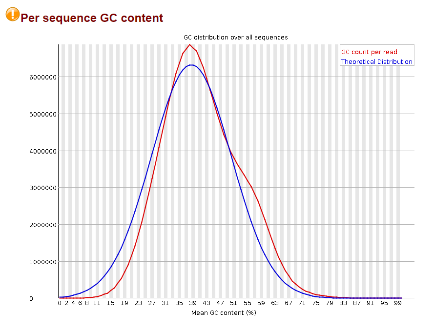

Per sequence GC content for <code>10M_ctrl_1.fastq</code>

While the per base sequence content looks at the proportions of each base at each position in a read, the per sequence GC content takes a look at the average GC content for all your sequence reads (<strong>Fig 9</strong>). In this analysis module, you're provided with the distribution of %GC content for your sequence file, and it gives you an idea if there may be an issue with your library prep. Usually, you should expect that without any experimental biases, the peak of your %GC content distribution should be match up roughly to the %GC content of your model organism's genome. The theoretical curve is calculated based on the sequence data you provide to FastQC, where it assumes a normal distribution around the modal GC content. If you see an unexpected distribution of %GC content, then that may point to an issue with your library, potentially an overexpressed gene or some contamination of your prep.

<h2>Per base N content</h2>

<h4 style="text-align: center;"><strong>Fig 10</strong></h4>
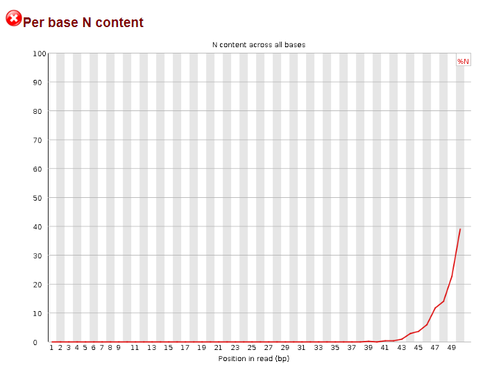

Per base N content for <code>10M_ctrl_1.fastq</code>

This analysis module will let you know if there may have been issues calling bases along a specific position among all your sequence reads (<strong>Fig 10</strong>). In the ChIP-seq dataset that we're using, you can see that towards the end of the read, there is a fairly large increase in the proportion of Ns, causing this analysis module to be flagged as Fail. This usually points to an issue with the sequencing run.

Taken into consideration with the per base sequence content, there may have been an issue towards the end of the sequencing run.

<h2>Sequence length distribution</h2>

<h4 style="text-align: center;"><strong>Fig 11</strong></h4>
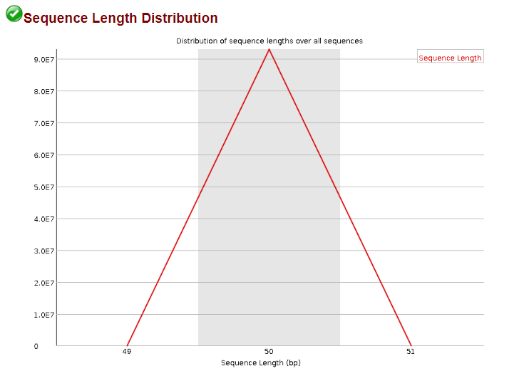

Sequence length distribution for <code>10M_ctrl_1.fastq</code>

This plots the distribution of the lengths of your sequence reads (<strong>Fig 11</strong>). Since Illumina sequencing platforms create reads of all the same length, you should expect a single length for all your sequence reads. Here, we can see that all the sequences are 50bp in length.

Other sequencing platforms may have a range of sequence read lengths, and you would be able to see there distribution through this analysis module.

<h2>Sequence duplication levels</h2>

<h4 style="text-align: center;"><strong>Fig 12</strong></h4>
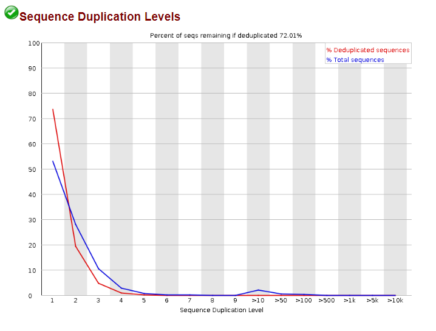

Sequence duplication levels for <code>10M_ctrl_1.fastq</code>

The sequence duplication levels module plots the distribution of the number of duplicate sequences within your sequence file (<strong>Fig 12</strong>). This analysis module assumes that an ideal library will have low levels of a diverse range of different sequence reads, indicating broad coverage. So a high level of duplication could suggest that there may be an issue with your library prep, resulting in some bias and an overrepresentation of certain fragments/sequences. However, your experimental design can also influence the composition of your library, and sometimes, you may expect there to be high levels of duplication of certain sequences, such as for very highly expressed genes. Another potential reason why this module may get flagged is if you have saturated your sequencing run, so subsequent reads are no longer as unique.

<h2>Overrepresented sequences</h2>

<h4 style="text-align: center;"><strong>Fig 13</strong></h4>

Overrepresented sequences for <code>10M_ctrl_1.fastq</code>

This module takes a look at the sequnces that appear to be overrepresented in your sample (<strong>Fig 13</strong>), and it can point to potential adapter contamination or some other bias in your dataset.

<h2>Adapter content</h2>

<h4 style="text-align: center;"><strong>Fig 14</strong></h4>
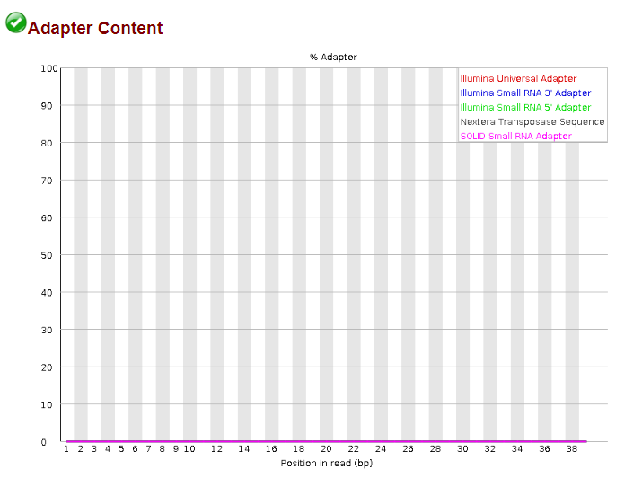

Adapter content for <code>10M_ctrl_1.fastq</code>

Illumina sequencing requires adapters to be ligated to both ends of DNA fragments to be sequenced in order for the DNA fragment to be anchored to the flow cell and for it to be clonally amplified. These adapters also are needed for the sequencing primers to bind to the single strand DNA template for sequencing by synthesis to occur. This analysis module takes a look at your sequence reads to determine if there is potential adapter sequences within them (<strong>Fig 14</strong>). An unusually high amount of adapter sequences that were captured in your sequencing run would be flagged by this  module and would indicate that you may want to perform some adapter trimming prior to aligning your reads.

In the case of the ChIP-seq dataset that we're working with, it looks like there's no adapter contamination.

<h1 style="font-size: 40px; margin-bottom: 0px;">ChIP-seq alignment</h1>

Today, we'll be aligning our four truncated datasets to our reference genome in class, and your homework this week will be to align the full datasets. Please note that the alignment can take quite a long time (3 hours or so).

Since <a href="#zanconatoetal2015"><u>Zanconato et al 2015</u></a> aligned their ChIP-seq data to the human genome build hg19, we'll be doing the same. We'll be making use of an aligner that Dr. Ingolia talked about in lecture, <strong>bowtie2</strong>. <a href="https://bowtie-bio.sourceforge.net/bowtie2/index.shtml" rel="noopener noreferrer" target="_blank"><u>Documentation for bowtie2 can be found here.</u></a>

<h2>Alignment</h2>

We'll be doing things a little bit in reverse today to help save time, since even with the truncated dataset, the alignment still takes some time to run. In this case, it should take ~20 minutes. So what we'll do is we'll first set up an alignment run, and then we'll go into the technical details about running the alignment as it runs in Terminal.

<h3>Prepare directory to receive alignment outputs</h3>

Let's go ahead and prepare a new directory that can receive our output, which will be our alignment files.

<ol>
    <li>Start up Terminal</li>
    <li>Make a new directory called <code>alignment</code></li>
    <li>Change to your newly created <code>alignment</code> directory</li>
</ol>

<h3>Align sequence data to h19 reference genome</h3>

Let's align our first sequence file using <code>bowtie2</code>.

<pre style="width: 450px; margin-top: 15px; margin-bottom: 15px; color: #000000; background-color: #EEEEEE; border: 1px solid; border-color: #AAAAAA; padding: 10px; border-radius: 15px; font-size: 12px;">&dollar;bowtie2 \
&gt;-x ~/shared/course/mcb201b-shared-readwrite/index/hg19 \
&gt;-U ~/shared/course/mcb201b-shared-readwrite/chip/10M_ctrl_1.fastq \
&gt;-S 10M_ctrl_1.sam</pre>

While that's running, let's review alignments, specifically looking at bowtie2.

<h2>Bowtie2</h2>

Aligning sequences to the genome can be quite tricky and computationally intensive. Recall from lecture that the sequences may not always be a perfect match, and in some cases, there may be short gaps in the sequences to get a good alignment (<strong>Fig 15</strong>). Moreover, the sequence reads that we are trying to align are usually around 50-150bp with millions of read for each sequence file, and each of those reads needs to be aligned to the reference genome, which for humans is approximately 3 billion basepairs.

<h4 style="text-align: center;"><strong>Fig 15</strong></h4>

Image from: Harvard Chan Bioinformatics Core

<h3>Reference genome and index</h3>

As Dr. Ingolia mentioned in the previous lecture, alignment software uses a genome index. While theoretically, you can align using the reference genome, converting the reference genome into an organized index enables faster searches through the genome to find alignments. As a result, bowtie2 is able to efficiently and relatively quickly align sequence reads. To keep it's memory usage on the lower end, bowtie2 uses an FM Index (which uses the Burrows-Wheeler Transform mentioned in lecture).

So normally before you perform your alignments, you will need to build an index from your reference genome, which can take some time, especially for larger genome sizes. Fortunately for us, bowtie2's documentation also provides a link to a pre-built index for hg19. The index files can be found in the shared folder for this course, and we've called them up when we ran our first alignment.

<h3>Alignment</h3>

To get an idea of how to use bowtie2 to align our sequences, let's take a look at it's manual:

<pre style="width: 450px; margin-top: 15px; margin-bottom: 15px; color: #000000;background-color: #EEEEEE; border: 1px solid; border-color: #AAAAAA; padding: 10px; border-radius: 15px;">&dollar;bowtie2 --help</pre>

This should output the manual with information on how to set up our input:

<pre style="width: 450px; margin-top: 15px; margin-bottom: 15px; color: #000000;background-color: #EEEEEE; border: 1px solid; border-color: #AAAAAA; padding: 10px; border-radius: 15px; font-size: 12px;">&dollar;bowtie2 [options]* -x &lt;bt2-idx&gt; {-1 &lt;m1&gt; -2 &lt;m2&gt; &vert; -U &lt;r&gt; &vert; 
--interleaved &lt;i&gt; &vert; -b &lt;bam&gt;} [-S &lt;sam&gt;]</pre>

So to use the bowtie2 aligner, you first specify the <code>bowtie2</code> command followed by options and arguments.

Now let's go back and take a look at the code that we ran to align our <code>10M_ctrl_1</code> sequence file and break down the input with respect to the information we pulled from the manual.

<pre style="width: 450px; margin-top: 15px; margin-bottom: 15px; color: #000000;background-color: #EEEEEE; border: 1px solid; border-color: #AAAAAA; padding: 10px; border-radius: 15px; font-size: 12px;">&dollar;bowtie2 \
&gt;-x ~/shared/course/mcb201b-shared-readwrite/index/hg19 \
&gt;-U ~/shared/course/mcb201b-shared-readwrite/chip/10M_ctrl_1.fastq \
&gt;-S 10M_ctrl_1.sam</pre>

<code>bowtie2</code> 

This is the command to call up the aligner.

<code>-x &lt;bt2-idx&gt;</code> 

This argument specifies the file path to where the index files are located along with the basename of the index files.

So for our input, we provided the file path to where the index files were located <code>~/shared/course/mcb201b-shared-read-write/</code> along with the basename of our index files <code>hg19</code>.
 

<strong>So the resulting input in our example is:</strong>

<code>~/shared/course/mcb201b-shared-readwrite/hg19</code>

<code>{-1 &lt;m1&gt; -2 &lt;m2&gt; &vert; -U &lt;r&gt; &vert; --interleaved &lt;i&gt; &vert; -b &lt;bam&gt;}</code> 

This argument specifies the file that you want to align. Bowtie2 is able to align paired-end reads <code>-1 &lt;m1&gt; -2 &lt;m2&gt;</code>, or unpaired reads <code>-U &lt;r&gt;</code>, interleaved fastq files <code>--interleaved &lt;i&gt;</code>, and unaligned BAM files <code>-b &lt;bam&gt;</code>.

So in our case, the ChIP-seq dataset that we're working with is unpaired, so we can use <code>-U</code> to specify that we're providing unpaired sequence reads followed by the file name for our fastq.gz file.

<strong>So the resulting input in our example is:</strong>

<code>-U ~/shared/course/mcb201b-shared-readwrite/chip/10M_ctrl_1.fastq</code>

<code>[-S &lt;sam&gt;]</code>

Here, we specify our output file name, and if we want to save the SAM file in a directory that is not our current working directory, we can include the file path as well. But since we'll be saving the output to our current directory, we can just specify the file name.

<strong>So the resulting input in our example is:</strong>

<code>-S 10M_ctrl_1.sam</code>

<h2>Perform alignment for 10M_taz_1</h2>

Now that we've done an example for a ctrl file, try running an alignment using the 10M_taz_1 dataset <u>in the background</u> by adding an <code>&amp;</code> at the end of your input. Once everyone's alignment is running, we'll continue with the next section, while bowtie2 runs in the background.

<h2>Reading the SAM file</h2>

While that's running in the background, let's take a look at our <code>10M_ctrl_1.sam</code> file. Recall from lecture that SAM files have a specific structure (<strong>Fig 16</strong>), where an aligned sequence read retains its original identifying information but now this information is also associated with a specific genomic location, and things are just slightly rearranged a bit.

<h4 style="text-align: center;"><strong>Fig 16</strong></h4>
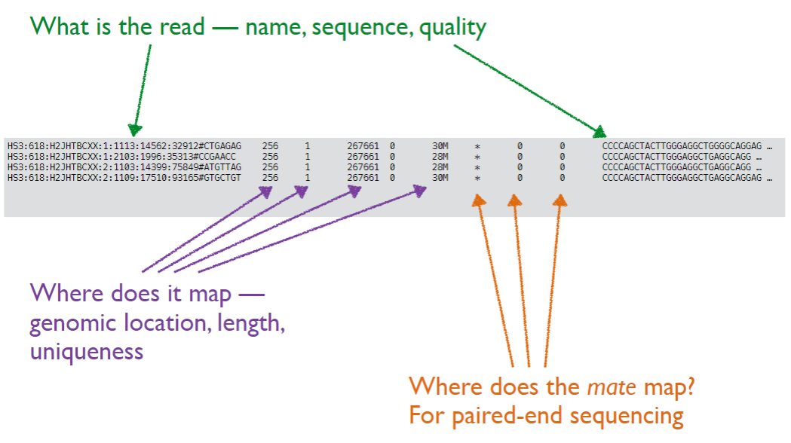

Image from Dr. Nick Ingolia

<h2>In-class exercise: viewing a SAM file</h2>

For this exercise, output your <code>10M_ctrl_1.sam</code> file outside of the standard output using the <code>less</code> command, and take a look at the SAM file.

You should see a lot of header lines indicated by an &commat;. The alignment information are the lines after those header lines.

There are a fair number of columns to the SAM file, so you probably see that a single line will wrap to the next line, making it more difficult to read. You might have noticed that the values within the SAM file are separated by tabs, so try to export just the first 100 lines of our SAM file into a tab-separated values file (<strong>.tsv</strong>). That way, we can open it up just the first 100 lines in excel to see each column more easily.

Once you've exported the first 100 lines into a .tsv file, open it up in Excel to view its contents.

Unfortunately, the columns do not come with headers, so <a href="https://bowtie-bio.sourceforge.net/bowtie2/manual.shtml#sam-output" rel="noopener noreferrer" target="_blank"><u>we'll have to look into the documentation to figure out what each column indicates.</u></a>

To figure out what the FLAG column is telling us, we can look back to the bowtie2 documentation, or <a href="https://broadinstitute.github.io/picard/explain-flags.html" rel="noopener noreferrer" target="_blank"><u>we can also use the Broad Institute's sam FLAG  decoder.</u></a>

For the optional tags, their definitions can be found also in the bowtie2 documentation.

<h2>Sort and index alignments</h2>

Recall from lecture that genome viewers usually assume that the alignment data that you give it is sorted by its mapped location. The genome viewer we will be using (IGV) requires us to provide it with a sorted and indexed BAM alignment file in order for it to display the aligned reads.

<h3>Convert SAM to BAM</h3>

The first thing we'll need to do is to convert our SAM file to a BAM file, which is a compressed, binary file. To do this, we'll use the <code>samtools</code> command. <a href="https://www.htslib.org/doc/" rel="noopener noreferrer" target="_blank"><u>Documentation can be found here.</u></a>

<pre style="width: 450px; margin-top: 15px; margin-bottom: 15px; color: #000000;background-color: #EEEEEE; border: 1px solid; border-color: #AAAAAA; padding: 10px; border-radius: 15px; font-size: 12px;">&dollar;samtools view -b -o 10M_ctrl_1.bam 10M_ctrl_1.sam</pre>

Let's break down this line:

<code>samtools</code> 

This is the command to call up <code>samtools</code>.

<code>view</code> 

This indicates that we want to make use of the sub-command <code>view</code>, which is used to convert SAM to BAM and vice versa.

<code>-b</code> 

This tells the view sub-command that we want it to output a BAM file, so essentially convert the SAM file to a BAM file.

<code>-o 10M_ctrl_1.bam</code> 

This specifies the output file information. Here is where we provide the sub-command with the file name.

<code>10M_ctrl_1.sam</code> 

This is the name of the file that we are providing to the sub-command to convert to a BAM file.

<h3>Sort the BAM file</h3>

To sort your BAM file, you can use the <code>sort</code> sub-command within the <code>samtools</code> command.

<pre style="width: 450px; margin-top: 15px; margin-bottom: 15px; color: #000000;background-color: #EEEEEE; border: 1px solid; border-color: #AAAAAA; padding: 10px; border-radius: 15px; font-size: 12px;">&dollar;samtools sort -o 10M_ctrl_1-sorted.bam 10M_ctrl_1.bam</pre>

Let's break down the above line:

<code>samtools</code> 

This is the command to call up <code>samtools</code> just like before.

<code>sort</code> 

This calls up the <code>sort</code> sub-command, which gives us the ability to sort our aligned reads by their chromosomal position.

<code>-o 10M_ctrl_1-sorted.bam</code> 

This specifies the output file information.

<code>10M_ctrl_1.bam</code> 

This is the file that contains the alignments that we want to sort based on their chromosomal position.

<h3>Index the sorted BAM file</h3>

Like with how we needed to create a genome index to allow bowtie2 to quickly access the sequence information, we need to index our sorted BAM file to allow for quick access to our alignment data. To index our sorted BAM files, we will use the <code>index</code> sub-command and provide it with the BAM file we want it to index:

<pre style="width: 450px; margin-top: 15px; margin-bottom: 15px; color: #000000;background-color: #EEEEEE; border: 1px solid; border-color: #AAAAAA; padding: 10px; border-radius: 15px; font-size: 12px;">&dollar;samtools index 10M_ctrl_1-sorted.bam</pre>

You should now have three outputs from converting, sorting, and indexing:

<pre>
10M_ctrl_1.bam
10M_ctrl_1-sorted.bam
10M_ctrl_1-sorted.bai
</pre>

<h2>Challenge exercise: View your sorted BAM file</h2>

See if you can figure out how to create a .tsv file of the first 50 rows of <code>10M_ctrl_1-sorted.bam</code> by using the <code>view</code> sub-command. <u>Hint:</u> If you specify the sub-command without any options and only the input file, it will output the rows directly into Terminal.

<h1 style="font-size: 40px; margin-bottom: 0px;">Visualize aligned reads</h1>

To prepare to visualize your aligned reads in IGV, download the following files:

<ol>
    <li>Your sorted BAM file: <code>10M_ctrl_1-sorted.bam</code></li>
    <li>The sorted and indexed BAM file: <code>10M_ctrl_1-sorted.bai</code></li>
</ol>

Now, let's open up IGV and visualize our alignments.

<h1 style="font-size: 40px; margin-bottom: 0px;">References</h1>

<a href="https://pubmed.ncbi.nlm.nih.gov/19549630/" rel="noopener noreferrer" target="_blank"><u>Whiteford et al 2009 Bioinformatics:</u></a> Swift: primary data analysis for the Illumina Solexa sequencing platform

<a href="https://bionumbers.hms.harvard.edu/bionumber.aspx?id=100679&ver=5&trm=gc+content+human+genome&org=" rel="noopener noreferrer" target="_blank"><u>Bionumbers for human genome GC content</u></a>

<a href="https://www.nature.com/articles/ncb3216" rel="noopener noreferrer" target="_blank"><u>Zanconato et al 2015 Nat Cell Biol:</u></a> ChIP–seq: advantages and challenges of a maturing technology

