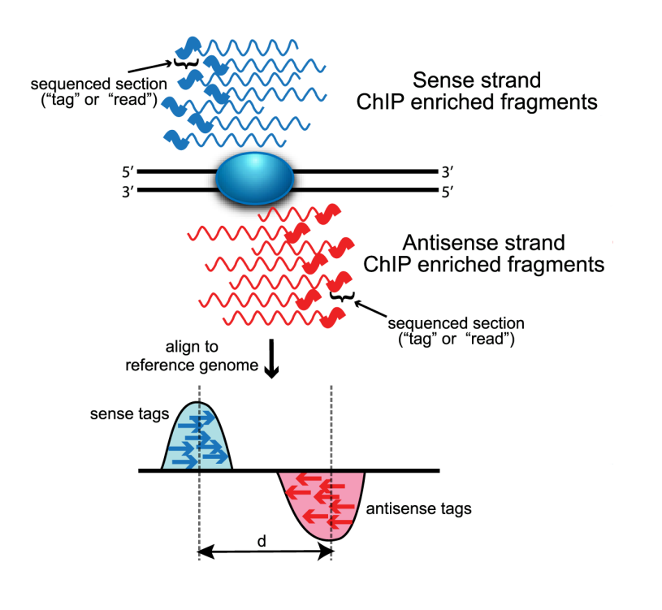

<h1 style="font-size: 40px; margin-bottom: 0px;">7.2 Peak calling</h1>

Now that we've aligned our datasets, we can now begin to determine where the peaks are located within our data to get a clearer picture of where our transcription factor may be binding. And once we've modeled the peaks from our alignment data, we can then visualize them using IGV, similarly to how we visualized the raw alignments.

<strong>Learning objectives:</strong>

<ul>
    <li>Review how alignment data is used to generate peaks</li>
    <li>Understand macs2 peak calling</li>
    <li>Understand macs2 outputs</li>
    <li>Play with the data in Python</li>
    <li>Visualize peaks in IGV</li>
</ul>

<h1 style="font-size: 40px; margin-bottom: 0px;">Peak calling</h1>

Recall from lecture how Dr. Ingolia mentioned that when reads are sequenced, they can be sequenced either on the sense strand or the anti-sense strand. And there are two consequences of this. One of the first ones is visible in our raw alignment data, where some sequences are given a FLAG value of <code>16</code> indicating that these reads correspond to the reverse strand. And the second consequence of this arises when we align our reads to the genome. There will be reads piling up on both sides of the site where the transcription factor is binding (<strong>Fig 1</strong>). We'll take a look at this later on as one of our outputs from our macs2 analysis.

<h4 style="text-align: center;"><strong>Fig 1</strong></h4>

Image from: Image from: <a href="#wilbanksfacciotti2010"><u>Wilbanks and Facciotti 2010 PLoS ONE</u></a>

The actual binding site is then halfway between the resulting two pile up peaks. The shift can then be modeled to get an idea of where the sites to where the protein is binding.

<h2>MACS2</h2>

As you have seen when looking just at the raw alignments, there are areas in the genome where multiple reads map to, creating an area of piled up reads. Model-based Analysis of ChIP-Seq (MACS) allows us to identify the peaks of where transcription factors or other DNA binding proteins may be binding to the genome by evaluating the alignment data for enriched regions and taking into account the sequencing tag position. <a href="https://pypi.org/project/MACS2/" rel="noopener noreferrer" target="_blank"><u>Documentation for macs2 can be found here.</u></a>

<h3>Run macs2 for just control data</h3>

Looking into the methods of <a href="#zanconatoetal2015"><u>Zanconato et al 2015</u></a> a little bit more. We can see that they use the IgG files as their controls, and if we look into the information they provided along with their sequence files:

    
Pooling of IgG_rep1_ChIPSeq and IgG_rep2_ChIPSeq was used as control for Peak calling 

So what they've done is pool together two of their IgG alignments to act as the control for peak calling in order to determine what the level of background is. So when we perform peak calling for the truncated TAZ datasets, we will provide two BAM files for the control.

Let's determine the peaks for our two control datasets at once.

First change into our shared directory to make the file paths that we'll work with shorter:

<pre style="width: 450px; margin-top: 15px; margin-bottom: 15px; color: #000000; background-color: #EEEEEE; border: 1px solid; border-color: #AAAAAA; padding: 10px; border-radius: 15px; font-size: 12px;">cd ~/shared/course/mcb201b-shared-readwrite/chip/truncated</pre>

Now that we've updated our current working directory, let's take a look at what files are inside:
 

<pre style="width: 450px; margin-top: 15px; margin-bottom: 15px; color: #000000; background-color: #EEEEEE; border: 1px solid; border-color: #AAAAAA; padding: 10px; border-radius: 15px; font-size: 12px;">ls</pre>

You should see that this directory contains all our sorted and indexed BAM alignment files. And now that we're in this folder with all the files we'll need for our peak calling, we can just type in the file names when we specify what files we want to use. That keeps the command line from getting too unwieldy with the long file path.

Now let's run <code>macs2</code> for our control, pooling together the two IgG replicates.

<pre style="width: 450px; margin-top: 15px; margin-bottom: 15px; color: #000000; background-color: #EEEEEE; border: 1px solid; border-color: #AAAAAA; padding: 10px; border-radius: 15px; font-size: 12px;">macs2 callpeak \
-t 10M_ctrl_1-sorted.bam 10M_ctrl_2-sorted.bam \
-g hs \
--outdir ~/MCB201B_F2024/Week_7/macs2 \
--bdg
-n 10M_ctrl</pre>

<strong>So breaking down the code:</strong>

<code>macs2</code>

This calls up the macs2 command for us to perform peak calling using our sorted and indexed BAM alignment files.

<code>callpeak</code>

This calls up the callpeak sub-command indicating that we want to perform peak calling.

<code>-t 10M_ctrl_1-sorted.bam 10M_ctrl_2-sorted.bam</code>

Here, we specify the "treatment" alignment file(s), which are the files that we will pool together to calculate peaks. Because Zanconato et al 2015 pooled together two control replicates as their control, we will do the same here. We won't specify a control alignment file here.

<code>-g hs</code>

We provide an effective genome size so that <code>macs2</code> can determine statistical significance. <code>macs2</code> has some known effective genome sizes for common model organisms and humans. So we can specify the effective genome size as <code>hs</code>, which will correspond to <code>2.7e9</code>, or 2.7 billion basepairs. If you take a look into the documentation using <code>macs2 callpeak --help</code>, you can see what the effective genome sizes are for other model organisms that macs2 has stored.

<code>--outdir ~/MCB201B_F2024/Week_7/macs2</code>

Here, we specify the directory that will hold our outputs. If the directory doesn't exist, macs2 will create it when it runs. In this case, we haven't created a directory called macs2 yet, so when we run macs2, it will automatically create that directory for us, and it will populate it with its outputs. Since we're not creating a directory in our current working directory, we specify the outdir with a file path.

<code>--bdg</code>

An optional output that we want macs2 to also give us is a <a href="https://genome.ucsc.edu/goldenPath/help/bedgraph.html" rel="noopener noreferrer" target="_blank"><u>.bedgraph file</u></a>, which contains information of read coverage along the genome. So rather than seeing discrete reads, we'll see a value at each chromosomal position that increases or decreases along the length of the genome with increasing or decreasing amounts of read coverage.

Some other peak callers may provide you with a wiggle track or BigWig file, which is similar to .bedgraph in that they all contain information on the depth of coverage along the genome.

<code>-n 10M_ctrl</code>

We specify the basename for our output files, so we know that all the outputs that will result from this macs2 run will share the same basename <code>10M_ctrl</code>.

<h2>Peak calling for taz_1</h2>

Now let's find the peaks for our first TAZ file:

<pre style="width: 450px; margin-top: 15px; margin-bottom: 15px; color: #000000; background-color: #EEEEEE; border: 1px solid; border-color: #AAAAAA; padding: 10px; border-radius: 15px; font-size: 12px;">macs2 callpeak \
-t 10M_taz_1-sorted.bam \
-c 10M_ctrl_1-sorted.bam 10M_ctrl_2-sorted.bam \
-g hs \
--outdir ~/MCB201B_F2024/Week_7/macs2 \
--bdg
-n 10M_taz_1</pre>

What's different here is that we're now giving <code>macs2</code> two control files to pool together in order to determine which peaks are actually significantly above background. In this case, it will use the alignments from our <code>10M_ctrl_1</code> and <code>10M_ctrl_2</code> to determine what the background bias is.

We specify the control by using the <code>-c</code> option, and follow it with two file names that we want it to pool as a single control.

We'll also be saving the output files to the same directory that we saved our control outputs in.

<h2>Exercise: Find peaks for taz_2</h2>

Here, use <code>macs2</code> to find the peaks for <code>10M_taz_2-sorted.bam</code>, and you can save it to the same output directory that we've been using so far.

<h2>MACS2 outputs</h2>

What you'll see is that inside your macs2 output directory, there is now a bunch of new files all sharing the same basename <code>10M_ctrl</code>, or <code>10M_taz_1</code>, or <code>10M_taz_2</code>.

<ul>
    <li><code>{BASENAME}_control_lambda.bdg</code> - this is a bedgraph file is the estimated local bias based on the control you provided. In the case of our control run, since we didn't provide a control file, the lambda is estimated based on the local background, since just biologically some regions of the genome may have a greater bias in sequencing, leading to background peaks. It looks throughout the genome to estimate how prone different regions are to a bias in sequencing.</li>
    <li><code>{BASENAME}_model.r</code> - this is an R script that we can run in Terminal to output a PDF containing the graphs of your peak model and the cross-correlation plot.</li>
    <li><code>{BASENAME}_peaks.narrowPeak</code> - this is a BED-format annotation of the chromosomal interval covered by your peak.</li>
    <li><code>{BASENAME}_peaks.xls</code> - an Excel formatted file containing the information contained with the other files, including chromosome interval covered by the peak, significance (q and p values), fold enrichment relative to genomic background, and location of the summit. We'll be playing with these files later.</li>
    <li><code>{BASENAME}_summits.bed</code> - this is a BED-format annotation of the chromosomal location for each peak's summit.</li>
    <li><code>{BASENAME}_treat_pileup.bdg</code> - the bedgraph file for the alignment reads that you gave to <code>macs2</code> to determine peaks. In this case, we had it pool our two control IgG files as the "treatment".</li>
</ul>

<h3>Modeling the shift size</h3>

Let's take a look at the difference in how the sense and antisense strand reads aligned by running the R script to generate a PDF files containing two graphs, one for the peak model and the other for the shift size.

For this, we'll need to change to the directory containing our R script file to keep things simple.

<pre style="width: 450px; margin-top: 15px; margin-bottom: 15px; color: #000000; background-color: #EEEEEE; border: 1px solid; border-color: #AAAAAA; padding: 10px; border-radius: 15px; font-size: 12px;">cd ~/MCB201B_F2024/Week_7/macs2</pre>

Now, we'll start by taking a look at the peak model and shift size for <code>10M_taz_1</code> followed by the control set.

<pre style="width: 450px; margin-top: 15px; margin-bottom: 15px; color: #000000; background-color: #EEEEEE; border: 1px solid; border-color: #AAAAAA; padding: 10px; border-radius: 15px; font-size: 12px;">Rscript 10M_taz_1_model.r</pre>

You should see a new PDF file containing two graphs that was output by the R script (<strong>Fig 2 and 3</strong>).

<h4 style="text-align: center;"><strong>Fig 2</strong></h4>

This displays the distribution of the distances it takes the aligned reads to get to their shared center point, which is where the DNA binding protein should be bound. It determines the center based on the modes of the two read distributions.

<h4 style="text-align: center;"><strong>Fig 3</strong></h4>

This displays the cross-correlation, which is the distance it takes to shift both strands in order to reach the greatest degree of correlation between the sense and antisense peaks. There will almost always be a "phantom peak" which corresponds to the sequence read length (<a href="#landtetal2012"><u>Landt et al 2012 Genome Res</u></a>). In our case, we can see that one of the dashed red lines corresponds to a distance of 56, which is roughly our sequence read length (50bp). We can also see that the peak of highest correlation is at approximately 160bp distance.

<h2>Exercise: Run the R script for 10M_taz2 and 10M_ctrl.</h2>

See if you can run the R script for the remaining two .r files. Then we'll take a look at all of them together, and we can get an impression of how the ChIP experiment went.

<h1 style="font-size: 40px; margin-bottom: 0px;">Visualize peaks</h1>

Yesterday, we used IGV to visualize the raw alignments to see where they mapped to the genome. Today, we'll be using IGV to look at the peaks that were identified by <code>macs2</code> to see if we may have something interesting.

You'll need to download the following files off your server:

<ul>
    <li><code>{BASENAME}_peaks.narrowPeak</code></li>
    <li><code>{BASENAME}_summits.bed</code></li>
    <li><code>{BASENAME}_treat_pileup.bdg</li>
</ul>

And then, we can go into IGV to take a look at how the peaks look.

<h1 style="font-size: 40px; margin-bottom: 0px;">Play with the data in Python</h1>

Let's head on over to our Python notebook and play around with the data, so we can more easily identify strongly enriched or highly significant peaks to take a closer look at in IGV.

Go ahead an open up today's Python notebook.

<h1 style="font-size: 40px; margin-bottom: 0px;">References</h1>

<a href="https://www.nature.com/articles/ncb3216" rel="noopener noreferrer" target="_blank"><u>Zanconato et al 2015 Nat Cell Biol:</u></a> ChIP–seq: advantages and challenges of a maturing technology

<a href="https://www.nature.com/articles/ncb3216" rel="noopener noreferrer" target="_blank"><u>Wilbanks and Facciotti 2010 PLoS ONE:</u></a> Evaluation of Algorithm Performance in ChIP-Seq Peak Detection

<a href="https://pubmed.ncbi.nlm.nih.gov/22955991/" rel="noopener noreferrer" target="_blank"><u>Landt et al 2012 Genome Res:</u></a> ChIP-seq guidelines and practices of the ENCODE and modENCODE consortia

