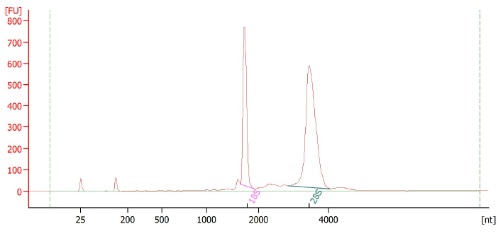
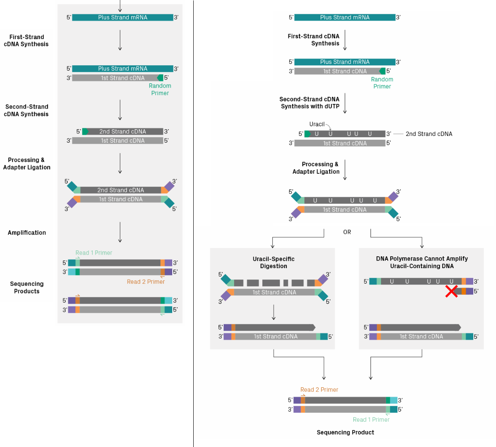
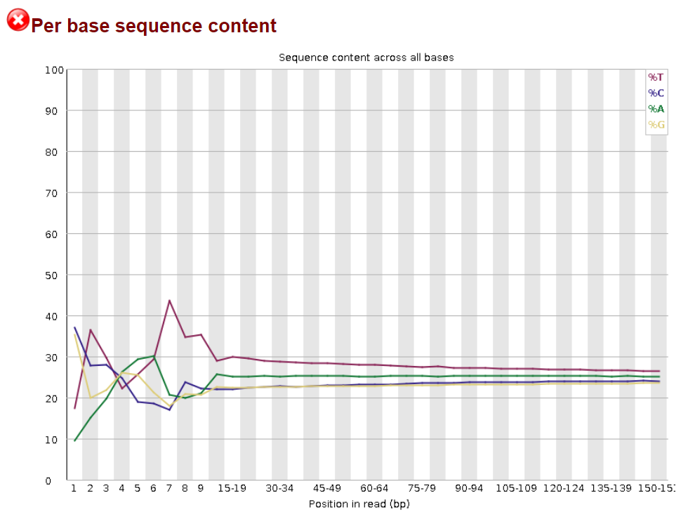
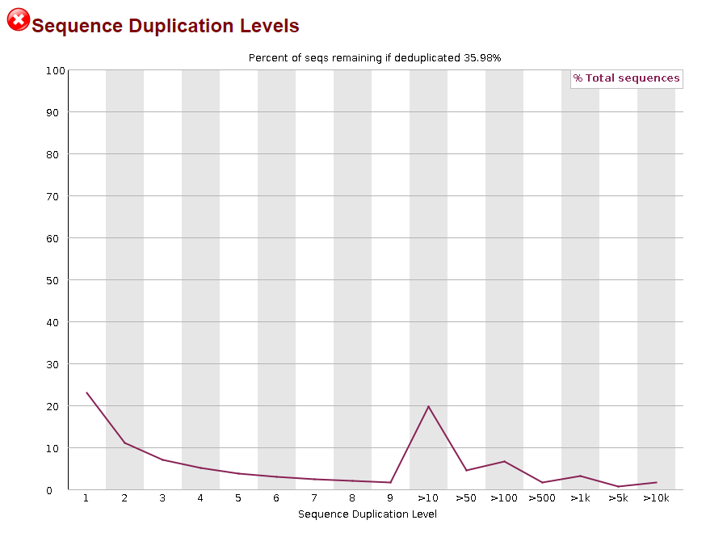
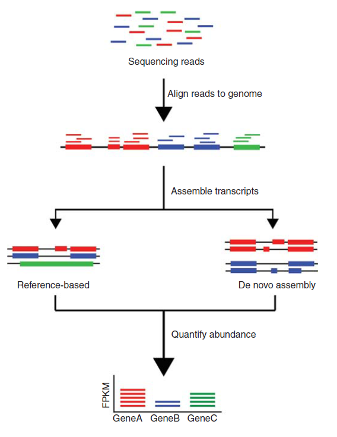

<h1 style="font-size: 40px; margin-bottom: 0px;">9.1 RNA-seq analysis pipeline and QC</h1>

<h1>Overview</h1>

Now that you've gotten more familiar with ChIP-seq analysis, we'll now move on to transcriptomics analysis, specifically looking at our RNA-seq data that we generated during the summer. Much like with our ChIP-seq analysis module, the goal of our RNA-seq analysis is to continue to provide you with additional practice analyzing large datasets. ChIP-seq allows us to infer what genes may be regulated by TAZ based on where TAZ (and TEAD) is binding in the genome. RNA-seq complements that by providing us with information on the transcriptomic changes that occur following TAZ KO, which provides a differnt angle for us to infer downstream transcriptional targets by looking at what genes are differentially expressed when we KO TAZ.

A lot of the broad concepts that we learned for ChIP-seq will be applicable to RNA-seq analysis as well even though the specifics may differ. Our sequence files are in the standard fastq format, and we'll still align our reads to a reference genome. And we can visualize the alignments again using IGV. After that, instead of looking at peaks, we'll be quantifying transcript abundance based on our alignment data, and then using that data to determine which genes are differentially expressed when we KO TAZ.

The setup of this module will be more fun because we'll be working with all the data that we've generated in the summer. In class, we'll work with a truncated dataset like we did with our ChIP-seq analysis. Each group will perform the initial QC, alignment, and quantification on their own replicates. Then, the fun part is that we'll as a class bring together all our replicates to play with the data and perform differential expression analysis.

<strong>Learning objectives:</strong>

<ul>
    <li>Learn to set up a basic shell script</li>
    <ul>
        <li>Truncate raw RNA-seq reads</li>
        <li>Output some reads to look at later</li>
        <li>Perform QC on truncated dataset</li>
    </ul>    
    <li>Understand general overview of the RNA-seq pipeline</li>
    <li>Review fastq sequence files and FastQC analysis</li>
</ul>

<h1 style="font-size: 40px; margin-bottom: 0px;">Basic shell script</h1>

Now that you're now more familiar with using Terminal to navigate directories, install packages, and run programs, we'll begin incorporating slightly more advanced usage. We will now begin setting up scripts to run a series of programs with a single command. That way, you don't need to sit and wait for Terminal to finish what it's doing to then tell it what to do next. You can provide it with a shell script that has all the commands that you want Terminal to run.

We'll first set up our shell script for today's lesson, then we'll let it run in the background while we discuss the RNA-seq pipeline and QC. Once the script is done running, we can then take a look at it's outputs and also double check to make sure that it ran as expected.

<h2>What is a shell script?</h2>

Shell scripts (or Bash scripts for <strong>B</strong>ourne <strong>a</strong>gain <strong>sh</strong>ell in our case) allow you to automate a series of commands/tasks, so you don't have to input each step separately after the previous one has completed. That way, with a single command in terminal, you can run all the commands that you need to complete your analysis. For next-gen sequencing analysis, this is essentially your analysis pipeline.

Shell scripts are just plain text files that contain all the commands that you want to run in Terminal. The extension for shell scripts are just <code>.sh</code> rather than <code>.txt</code>.

<h2>Setting up a basic shell script</h2>

Let's get started on writing a basic shell script and then running it in Terminal. First, in the File Browser, navigate to this week's directory. Then, open up your Launcher and start up a Text File, which you can find under the section "Other". Now save this file as <code>week-9-script.sh</code>. Make sure that you replace the <code>.txt</code> extension with the <code>.sh</code> extension. Nothing will have visibly changed, but as you type in code, you should see that different elements of your code will have different colors.

<h3>Find path to interpreter</h3>

To find the path, you can run the following command in Terminal:

<pre style="width: 450px; margin-top: 15px; margin-bottom: 15px; color: #000000; background-color: #EEEEEE; border: 1px solid; border-color: #AAAAAA; padding: 10px; border-radius: 15px; font-size: 12px;">echo &dollar;0</pre>

You should see an output that looks like: <code>/bin/bash</code>, which is the path to the interpreter for this shell. This will be important later when you start writing your shell script.

<h3>Input commands into shell script</h3>

The first line of your shell script file should contain a <code>&#35;&excl;/path/to/shell</code>, also known as a "hashbang" or "shebang", which is a special type of comment that specifies the path to the interpreter. In our case, we identifid the path to <code>bash</code> as <code>/bin/bash</code>.

So the first line in your shell script will be as follows:

<pre style="width: 450px; margin-top: 15px; margin-bottom: 15px; border: 1px solid; border-color: #AAAAAA; padding: 10px; border-radius: 4px; font-size: 12px; box-shadow: inset  0 0 5px 0 #CCCCCC;">#!/bin/bash</pre>

You might also notice that the color of the text changes as well.

Like with Python, we can include comments in our code with the hash symbol, <code>&#35;</code>. You might also notice that the color of the comment is different than that of the shebang.

Let's set up our script to output something basic into <i>stdout</i>, one of the output streams of Terminal.

<pre style="width: 450px; margin-top: 15px; margin-bottom: 15px; border: 1px solid; border-color: #AAAAAA; padding: 10px; border-radius: 4px; font-size: 12px; box-shadow: inset  0 0 5px 0 #CCCCCC;">#Let's output some text into stdout using the echo command
echo "I like cats"</pre>

Now save your shell script file, and let's go over into Terminal.

<h3>Make the shell script executable</h3>

In order for Terminal to run the shell script you just made, you will need to make it executable. First, navigate to the directory containing your shell script.

<pre style="width: 450px; margin-top: 15px; margin-bottom: 15px; color: #000000; background-color: #EEEEEE; border: 1px solid; border-color: #AAAAAA; padding: 10px; border-radius: 15px; font-size: 12px;">cd ~/MCB201B_F2024/Week_9</pre>

Then make the shell script executable by inputting the following command:

<pre style="width: 450px; margin-top: 15px; margin-bottom: 15px; color: #000000; background-color: #EEEEEE; border: 1px solid; border-color: #AAAAAA; padding: 10px; border-radius: 15px; font-size: 12px;">chmod +x week-9-script.sh</pre>

<h3>Run your shell script</h3>

Now see if you can run your shell script and if it behaves as expected:

<pre style="width: 450px; margin-top: 15px; margin-bottom: 15px; color: #000000; background-color: #EEEEEE; border: 1px solid; border-color: #AAAAAA; padding: 10px; border-radius: 15px; font-size: 12px;">./week-9-script.sh</pre>

You should see in your output stream the text <code>I like cats</code>.

<h3>Add some complexity to your shell script</h3>

Let's add additional lines of comments and codes to see how they run when we have more than just a single line of code.

<pre style="width: 450px; margin-top: 15px; margin-bottom: 15px; border: 1px solid; border-color: #AAAAAA; padding: 10px; border-radius: 4px; font-size: 12px; box-shadow: inset  0 0 5px 0 #CCCCCC;">#Change to the Week_9 directory
cd ~/MCB201B_F2024/Week_9

#Create a shell_test directory
mkdir shell_test

#Output text into shell_test directory
echo "You like cats" > ./shell_test/cat.txt</pre>

<h1 style="font-size: 40px; margin-top: 0px; margin-bottom: 0px;">Guided exercise</h1>

<h2>Set up shell script to truncate, view, and QC data</h2>

Recall that the initial stages of our ChIP-seq analysis made use of various Terminal commands, and RNA-seq is no different. Since you're all familiar with the initial set up of the analysis, let's set up a script that is able to do the following:

<ul>
    <li>Make an output directory</li>
    <li>Truncate your fastq.gz files down to 1M reads to work with later on in class</li>
    <li>Output a txt file containing just the first 10 reads for us to take a look</li>
    <li>Run a FastQC analysis on your group's full read files</li>
</ul>

<h3>1. Create new <code>.sh</code> file</h3>

Name the shell script file <code>chop.sh</code>.

<h3>2. Start with shebang</h3>

<pre style="width: 450px; margin-top: 15px; margin-bottom: 15px; border: 1px solid; border-color: #AAAAAA; padding: 10px; border-radius: 4px; font-size: 12px; box-shadow: inset  0 0 5px 0 #CCCCCC;">#!/bin/bash</pre>

<h3>3. Change to this week's directory</h3>

<pre style="width: 450px; margin-top: 15px; margin-bottom: 15px; border: 1px solid; border-color: #AAAAAA; padding: 10px; border-radius: 4px; font-size: 12px; box-shadow: inset  0 0 5px 0 #CCCCCC;">#Change to Week_9 directory just in case

cd ~/MCB201B_F2024/Week_9</pre>

<h3>4. Make a new file for truncated data</h3>

<pre style="width: 450px; margin-top: 15px; margin-bottom: 15px; border: 1px solid; border-color: #AAAAAA; padding: 10px; border-radius: 4px; font-size: 12px; box-shadow: inset  0 0 5px 0 #CCCCCC;">#Make directory truncated data

mkdir truncated_data</pre>

<h3>5. Truncate data</h3>

<pre style="width: 450px; margin-top: 15px; margin-bottom: 15px; border: 1px solid; border-color: #AAAAAA; padding: 10px; border-radius: 4px; font-size: 12px; box-shadow: inset  0 0 5px 0 #CCCCCC;">#Truncate each fastq.gz file to 1M reads

zcat ~/shared/course/mcb201b-shared-readwrite/rna/g1/g1_control_r1.fastq.gz | head -n 4000000 > ./truncated_data/1M_g1_control_r1.fastq

#Now repeat for the remaining 3 fastq.gz files in your groups folder</pre>

<h3>6. Make subdirectory for viewing sequences</h3>

<pre style="width: 450px; margin-top: 15px; margin-bottom: 15px; border: 1px solid; border-color: #AAAAAA; padding: 10px; border-radius: 4px; font-size: 12px; box-shadow: inset  0 0 5px 0 #CCCCCC;">#Make subdirectory to hold txt files

mkdir ./truncated_data/seq_view</pre>

<h3>7. Pull out just first ten reads</h3>

<pre style="width: 450px; margin-top: 15px; margin-bottom: 15px; border: 1px solid; border-color: #AAAAAA; padding: 10px; border-radius: 4px; font-size: 12px; box-shadow: inset  0 0 5px 0 #CCCCCC;">#Pull out first 10 reads into txt files

head -n 40 ./truncated_data/1M_g1_control_r1.fastq > ./truncated_data/seq_view/first_ten_g1_control_r1.txt

#Repeat for your other truncated datasets</pre>

<h3>8. Make directory for fastqc outputs</h3>

<pre style="width: 450px; margin-top: 15px; margin-bottom: 15px; border: 1px solid; border-color: #AAAAAA; padding: 10px; border-radius: 4px; font-size: 12px; box-shadow: inset  0 0 5px 0 #CCCCCC;">#Make fastqc_results directory

mkdir fastqc_results</pre>

<h3>9. Run fastqc on full dataset</h3>

<pre style="width: 450px; margin-top: 15px; margin-bottom: 15px; border: 1px solid; border-color: #AAAAAA; padding: 10px; border-radius: 4px; font-size: 12px; box-shadow: inset  0 0 5px 0 #CCCCCC;">#Perform QC on full dataset

fastqc -o ./fastqc_results ~/shared/course/mcb201b-shared-readwrite/g1/g1_control_r1.fastq.gz

#Repeat for your group's other three files</pre>

<h2>Run your script</h2>

Now run your shell script, and while that runs, we can review the general RNA-seq process.

For those of you who are interested, we can compact this script by using a for loop if we have time at the end of today.

<h1 style="font-size: 40px; margin-top: 0px; margin-bottom: 0px;">RNA-seq overview</h1>

RNA-seq comprises a series of experiments and analysis programs much like ChIP-seq. First, an appropriate sample needs to be obtained and prepared for sequencing, followed by next-gen sequencing, then alignment. Where RNA-seq differs from ChIP-seq is that rather than calling peaks based on the read alignments, RNA-seq counts the reads associated with genomic features, specifically genes. The read counts between different conditions can be normalized and compared with differential expression analysis to find the differentially expressed genes, which can point to interesting candidates for follow up or provide a broad overview of how the gene expression profile has changed between conditions.

<h2>RNA collection</h2>

Recall from MCB201A, that we collected RNA from our cells to take a closer look at what genes are being regulated by TAZ in our MDA-MB-231 cells. So as Dr. Ingolia mentioned in lecture, one of the important steps in order to be able to effectively sequence mRNA is to enrich for the mRNA in our RNA sample. This is because the overall RNA population in a cell is largely comprised of ribosomal RNA (rRNA), which you can see based on our Bioanalyzer traces (<strong>Fig 1</strong>), where the rRNA peaks allow us to determine the overall integrity of our RNA sample.

<h4 style="text-align: center;"><strong>Fig 1</strong></h4>

Example Bioanalyzer trace from Group 1

<h2>Library prep</h2>

In order to get enough material to sequence, a cDNA library needs to be prepared from the enriched mRNA. Our unprepped RNA was sent to the FGL for QC and library prep, where they used the KAPA RNA HyperPrep Kit in order to prepare a cDNA library.

<h3>mRNA enrichment</h3>

After polyA selection, which enriches for mRNA by hybridizing their polyA tails to oligo-dTs. The oligo-dTs are attached to magnetic beads, which allow your mRNA to be pelleted and any unbound RNAs (your rRNAs, ncRNAs, etc) to be washed away. So this is like any standard pull-down experiment. The mRNA is then dissociated from the beads, leaving you with a sample enriched for mRNA.

<h3>mRNA fragmentation</h3>

Following mRNA enrichment, the mRNAs are fragmented using a combination of heat and magnesium, breaking the mRNAs into smaller fragments. This allows short reads to cover the span of the mRNA rather than being localized to just the ends of the mRNA.

<h3>RNA-seq strandedness</h3>

The basic idea is that when you create your cDNA library, you can selectively degrade one of your cDNA strands, and the one that is degraded depends on the specific protocol you are using. So when you amplify your cDNA library, you only have sequencing primers that are oriented a specific way, where each primer will only be associated with one strand of the cDNA rather than both (<strong>Fig 2</strong>).

<h4 style="text-align: center;"><strong>Fig 2</strong></h4>

Modified image from Azenta Life Sciences

In our case, our library was prepped with dUTPs incorporated into the second cDNA strand. Thus, the second cDNA strand cannot be amplified, and the first cDNA strand is sequenced. Therefore, our sequence data is considered directional on the first strand.(UC Berkeley QB3 Functional Genomics Lab).

As Dr. Ingolia talked about during lecture, the strandedness of your library has an impact on downstream alignment and read counting because some RNAs will be coded on the plus strand and others on the minus strand. We'll encounter this later on when we do our analyses.

<h2>Sequencing</h2>

Sequencing of cDNA libraries for our RNA-seq experiments is conceptually the same as for ChIP-seq. One key difference in our case is that our samples were sequenced using paired-end sequencing, which means that each fragment was sequenced from both ends.

This means that our sequencing data for each replicate has two fastq files associated with it, where one corresponds to the reads from the first mate and the other from the second mate. Otherwise, the type of results from sequencing are pretty similar to what we've seen with our ChIP-seq data.

<h2>FastQC of RNA-seq data</h2>

We'll make use again of FastQC to take a look at whether or not there were issues with our sequencing runs. There are some notable differences in how the FastQC outputs look between ChIP-seq data and RNA-seq data.

<h3>Per base sequence content</h3>

<h4 style="text-align: center;"><strong>Fig 3</strong></h4>

Following mRNA fragmentation, the mRNA needs a primer to bind for cDNA synthesis to occur. Because all the mRNA fragments will have different "starting" sequences, priming needs to be random. In reality though, random priming is not completely random, and there is often a bias with enrichment for certain bases. So RNA-seq data will often fail this analysis module (<strong>Fig 3</strong>).

<h3>Sequence duplication levels</h3>

<h4 style="text-align: center;"><strong>Fig 4</strong></h4>

Another difference that will show up in RNA-seq FastQC analyses compared to what we saw with ChIP-seq is the output of the analysis module quantifying the sequence duplication levels. Recall that FastQC assumes that an ideal library is a diverse one, which would mean that there shouldn't be overrepresented sequences in your sequencing data. However, for RNA-seq experiments, highly overexpressed genes will often be overrepresented in your dataset. So a warning or failure for this module isn't usually too big of an issue unless you weren't expecting it based on your experimental setup.

<h2>Alignment of RNA-seq data</h2>

Like with ChIP-seq, we need to align the reads to a reference. This allows us to later use the read alignments for downstream quantification. In ChIP-seq, the read alignments were usd to build coverage maps, and in the case of RNA-seq, we use the read alignments to determine the levels of expression for each gene in order to identify differentially expressed genes between our two conditions (<strong>Fig 5</strong>). There are special considerations that we need to keep in mind when aligning data from RNA-seq, which Dr. Ingolia touched upon, and we'll see when we perform the alignments next week.

<h4 style="text-align: center;"><strong>Fig 5</strong></h4>

Image from <a href="#kukurbamontgomery2015"><u>Kukurba and Montgomery 2015</u></a>

<h2>Quantification of aligned reads</h2>

The next step after aligning reads is to quantify the number of reads mapped to each gene to give us an idea of the level of expression of each gene within our cells (<strong>Fig 5</strong>). A matrix can then be created from all the raw counts, which is then fed into a program to determine which genes are differentially expressed between conditions.

<h2>Differential expression analysis</h2>

For differential expression analysis, we'll make use of both Python (and some R) to get a full table of differentially expressed genes along with their significance values and the log2 fold change in expression.

<h2>Clustering</h2>

From there, we can play around with our results to identify potential genes of interest. We can also cluster our data in various ways to see how consistent the replicates are with one another. This can also help you identify potential experimental variability, such as batch effects, that may impact your interpretation of the data.

<h2>Functional enrichment and annotation</h2>

We can take our differential expression dataset and take a look at what biological processes, pathways, or functions are enriched in our dataset. This can give us a broad picture of what changes are occurring within the cell based on the changes we find when we look at different broad groupings of our dataset.

<h1 style="font-size: 40px; margin-bottom: 0px;">References</h1>

<a href="https://doi.org/10.1101/pdb.top084970" rel="noopener noreferrer" target="_blank"><u>Kukurba and Montgomery 2015 CSH Protocols:</u></a> RNA Sequencing and Analysis

